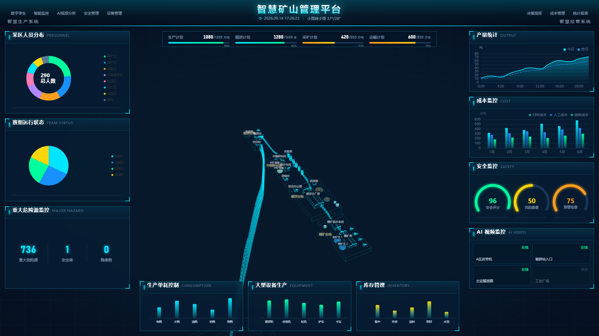
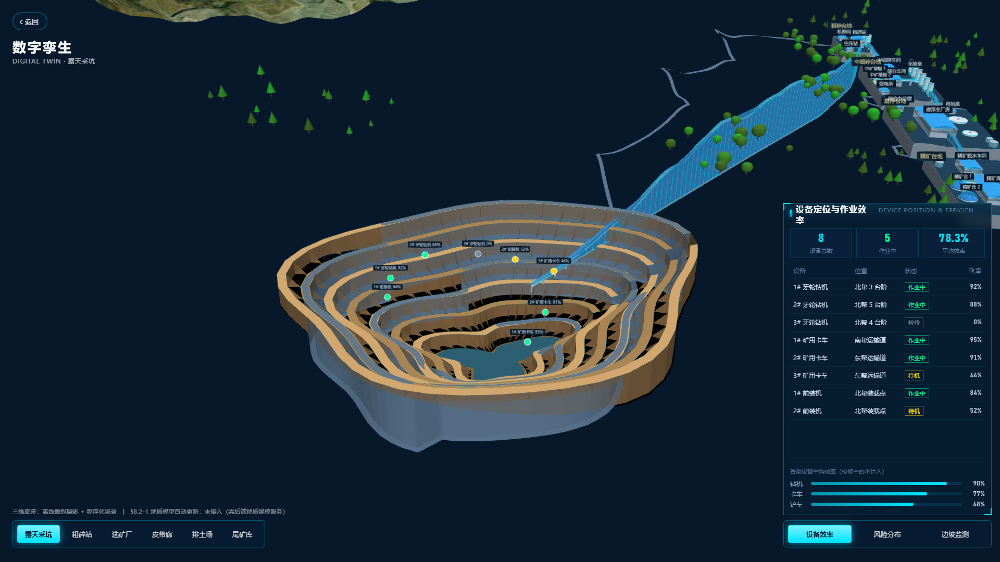
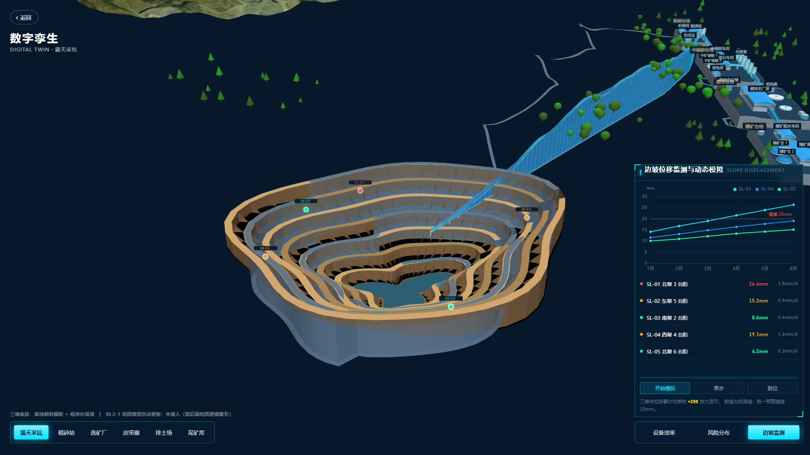
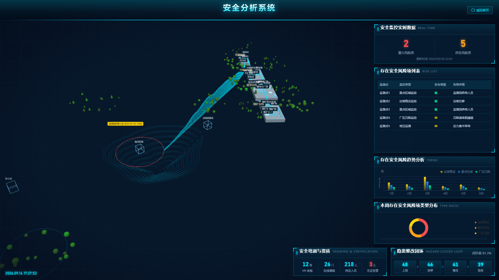
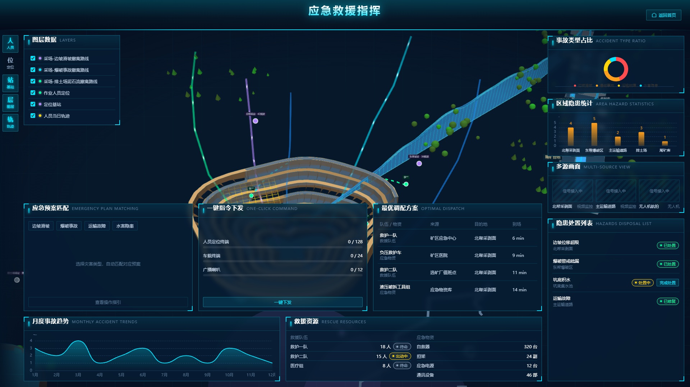
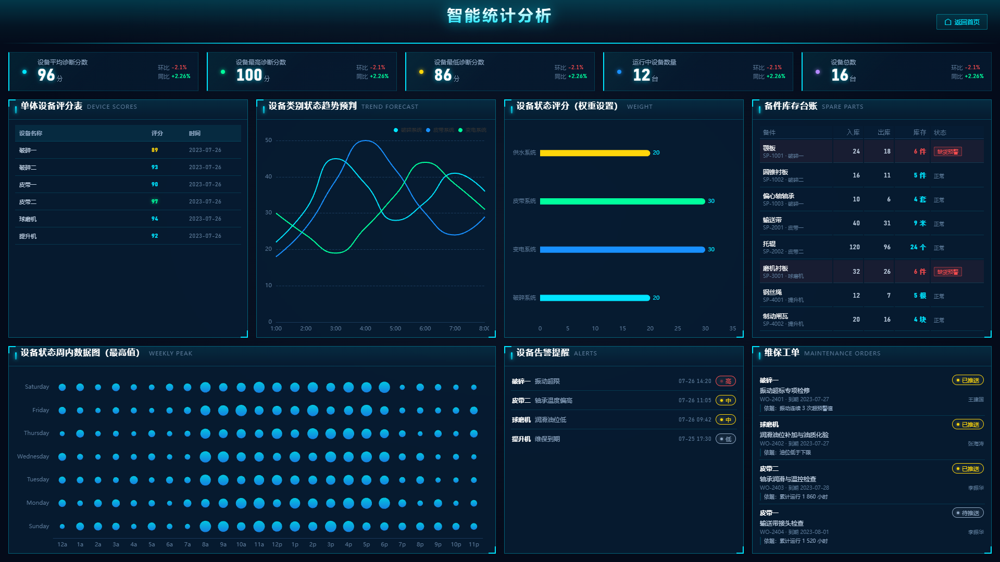
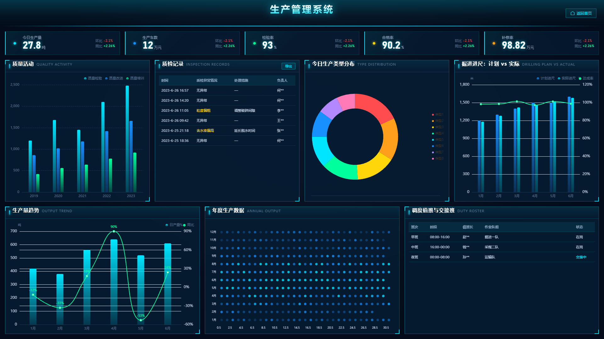
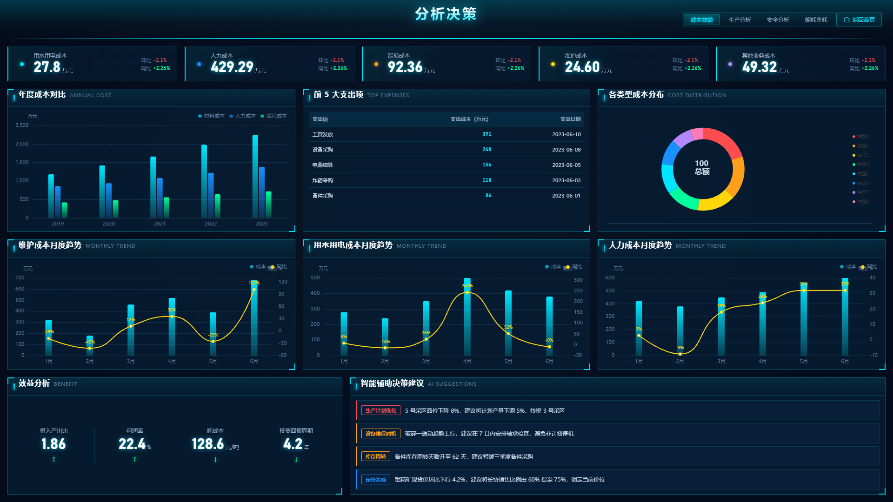
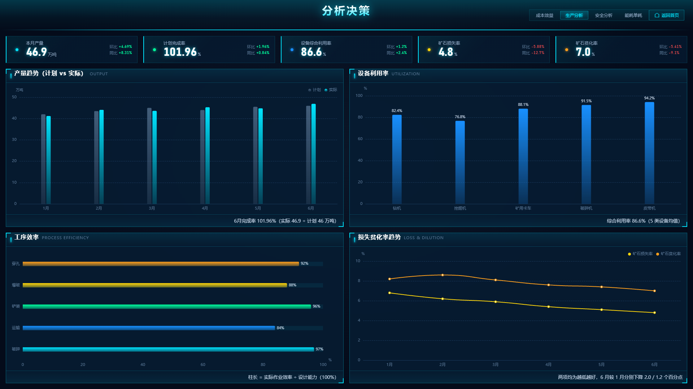
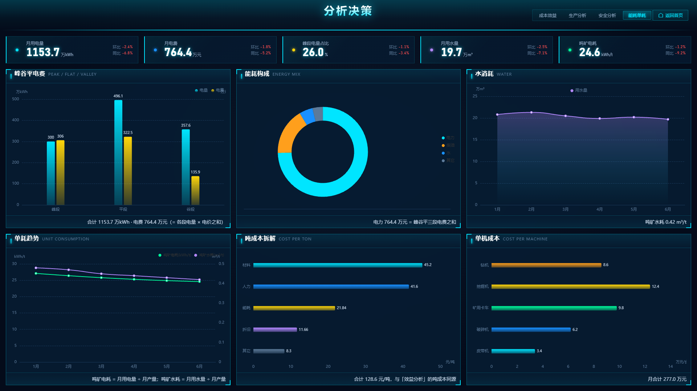

# ⛏️ 智慧矿山综合管控平台


## 📝 项目简介

面向**金属及非金属矿山**的智能化综合管控平台前端大屏系统。以**三维 GIS 为底座**，
围绕**安全管理、生产管理、设备管理、应急救援、数字孪生、分析决策**六大模块，
把分散在生产、设备、安全、成本上的人员与数据收进同一块屏幕，实现一体化呈现与协同管控。

- **三维底座是程序化重建的** —— CesiumJS 里按实测 DEM 与影像判读重建金堆城钼矿：
  露天采坑 7 级台阶 × 25m、顺谷四级分级台地选矿厂、11 条皮带廊、排土场、尾矿库；
  所有地物**逐点采样 DEM 高程贴地**，不是摆在海平面上。
- **完全离线可用** —— 矿区现场常常没有外网，所以影像与地形瓦片抓成本地 XYZ 目录
  （影像 12~17 级、高程 11~14 级）随仓库分发；接口不可用时自动降级到内置数据。
  断网环境下整个平台仍可完整演示，不依赖任何在线地图服务。
- **大屏自适应** —— 按 1920×1080 设计稿布局，运行时等比缩放居中，
  从笔记本到 3840×1080 拼接屏都不塌陷、不出滚动条。
- **工程门禁** —— 16 个带退出码的巡检脚本 + 7 个探针，把「面板被撑破」「图层没画出来」
  「坐标跑偏」「底图被悄悄删掉」这类**不报错的缺陷**变成可复现的红绿结论。

## ✨ 核心功能模块 (Features)

| 模块 | 路由 | 主要能力 |
|---|---|---|
| 🖥️ 综合首页 | `/` | 三维实景居中 + 左右各 5 块数据面板 + 生产计划进度 + 底部迷你图表 |
| 🏭 数字孪生 | `/digital-twin` | 全屏实景三维 + 6 个机位飞行 Tab；底部面板切三态（设备效率 / 风险分布 / 边坡监测），**切到哪一态就只显示哪一组图层** |
| 📹 AI 视频分析 | `/emergency` | 中央三块联动（应急预案匹配 / 一键指令下发 / 最优调配方案）+ 事故类型占比、区域隐患统计、隐患处置列表、避灾路线流动光带 |
| ⛑️ 安全管理 | `/safety` | 三维风险标注 + 实时数据 / 风险项列表 / 趋势分析 / 类型分布 / 培训资质 / 隐患整改闭环 |
| ⚙️ 设备管理 | `/equipment` | 5 指标卡 + 评分表 / 趋势预判 / 权重设置 / 备件库存台账 + 周内数据图 / 告警提醒 / 维保工单，点行打开设备档案浮层 |
| 🧭 决策指挥 | `/decision` | 顶栏四维切换：成本效益（8 块）/ 生产分析 / 安全分析 / 能耗单耗 |
| 📊 智能监控 | `/production` | 5 指标卡 + 质量活动、质检记录、生产类型分布 + 产量趋势、年度热力图、调度值班与交接班 |

## 📷 系统截图

> 以下截图由 `node scripts/make-screenshots.mjs` 生成，界面改动后重跑即可更新。

**🖥️ 综合首页总览** > 三维实景居中，左右各 5 块数据面板，顶部为双行导航（左「智慧生产系统」/ 右「智慧经营系统」）。


**🏭 数字孪生 · 设备定位与作业效率** > 全屏实景三维 + 底部 6 个机位飞行 Tab，底部面板显示设备定位与效率。


**⛰️ 数字孪生 · 边坡位移监测与动态模拟** > 切到「边坡监测」态后只显示边坡相关图层，含位移动态模拟。


**⛑️ 安全管理** > 三维风险标注叠加，配合风险项列表、趋势分析、类型分布与隐患整改闭环。


**📹 AI 视频分析** > 多源画面 + 应急预案匹配 / 一键指令下发 / 最优调配方案三块联动，避灾路线带流动光效。


**⚙️ 设备管理** > 指标卡 + 评分表 / 趋势预判 / 备件库存台账 / 告警提醒 / 维保工单，点行打开设备档案浮层。


**📊 智能监控** > 质量活动与质检记录、生产类型分布、产量趋势、年度热力图与调度值班。


**🧭 决策指挥 · 成本效益** > 年度成本对比、前 5 大支出项、各类型成本分布，及维护 / 用水用电 / 人力成本月度趋势。


**🧭 决策指挥 · 生产分析** > 产量趋势（计划 vs 实际）、设备利用率、工序效率、损失贫化率趋势。


**🧭 决策指挥 · 能耗单耗** > 峰谷平电费、能耗构成、水消耗、单耗趋势、吨成本拆解与单机成本。


---

## 一、技术栈

| 层级 | 选型 | 版本 | 说明 |
|---|---|---|---|
| 前端框架 | Vue 3 + TypeScript + Vite | 3.5 / 5.7 / 6.4 | 组合式 API |
| 三维 GIS | CesiumJS | 1.140 | 三维地球、实体渲染、相机飞行 |
| 图表 | ECharts | 5.6 | 全部图表统一深色主题 |
| UI 组件 | Element Plus | 2.14 | 深色主题定制，主要用于表格 |
| 状态管理 | Pinia | 2.3 | 已接入，当前各页以组合式状态为主 |
| 路由 | Vue Router | 4.5 | hash 模式，静态部署无需服务端 rewrite |
| 样式 | SCSS | 1.104 | CSS 变量统一主题 |

---

## 二、快速开始

```bash
npm install          # 安装依赖，并自动拷贝 Cesium 静态资源（postinstall）
npm run dev          # 开发服务，默认 http://localhost:5173
npm run build        # 类型检查 + 生产构建，产物在 dist/
npm run preview      # 本地预览构建产物
npm run typecheck    # 仅做类型检查
```

> **首次安装提示**：`postinstall` 会把 `node_modules/cesium/Build/Cesium` 下的
> `Workers / Assets / Widgets / ThirdParty` 拷到 `public/cesium/`（约 7.6MB）。
> 这一步是必须的——Cesium 的 Worker 与贴图在运行时按 `CESIUM_BASE_URL` 动态加载，
> 不参与打包。若拷贝失败，手动执行 `npm run cesium:assets`。

---

## 三、目录结构

```
├── public/
│   ├── cesium/                  Cesium 运行时资源（postinstall 生成，不入库）
│   └── map-tiles/               离线卫星底图瓦片（抓取脚本生成）
├── screenshots/                 README 系统截图（由 make-screenshots.mjs 生成）
├── scripts/                     （命名约定见第十一节；`_` 前缀 = 用完即删，不入库）
│   ├── copy-cesium-assets.mjs   Cesium 资源拷贝（postinstall 自动跑）
│   ├── fetch-map-tiles.mjs      离线影像与高程瓦片抓取
│   ├── prune-map-tiles.mjs      清理换矿区后越界的旧瓦片
│   ├── sample-heights.mjs       从 DEM 采样高程（定机位高度用）
│   │
│   ├── check-all-pages.mjs      全站巡检（逐页截图 + 错误统计，有退出码）
│   ├── check-nav.mjs            顶栏巡检（每个 Tab 点下去是否真的跳转）
│   ├── check-panel-overflow.mjs 面板体检（内容撑破 / 图表溢出 / 面板互相重叠 + 页签遍历）
│   ├── check-clock-motion.mjs   场景时钟与流动光带（**唯一不停渲染循环的脚本**）
│   ├── check-twin-layers.mjs    数字孪生页三维图层（结构性审计 + 像素 + 边坡模拟）
│   ├── check-emergency.mjs      应急救援页专项检查（图层齐全 + 指令状态机 + 预案弹窗）
│   ├── check-equipment.mjs      设备管理页专项检查（台账等式 / 缺货预警 / 档案浮层 / 工单）
│   ├── check-decision.mjs       分析决策页专项检查（四维切换 + 面板间的算术自洽）
│   ├── check-realtime.mjs       实时链路端到端验证（配 ws-stub.mjs 使用）
│   ├── ws-stub.mjs              手写的最小 WS 服务端，仅测试用，后端就绪后可删
│   ├── check-terrain-levels.mjs 地形细分深度巡检（贴地机位下不许越过 Cesium 数组上限）
│   ├── check-entity-heights.mjs 面实体高程巡检（不许再有「没写高程、默认落在海拔 0」的面）
│   ├── check-ground-cover.mjs   地物与底图的遮挡关系（可见面不许被底图盖住 / 底边不许悬空）
│   ├── check-imagery-placeholder.mjs 底图占位瓦片与 hasAlphaChannel 的自洽性
│   ├── check-layout.mjs         多分辨率布局体检
│   ├── check-scene-load.mjs     建场景加载 + 滚轮缩放后底图存活（跨 12s 窗口）
│   │
│   ├── make-screenshots.mjs     生成 README 系统截图（产出到 screenshots/）
│   │
│   ├── probe-grid.mjs           底图叠加经纬网，供人工判读坐标
│   ├── verify-alignment.mjs     坐标对齐核验（投影回屏幕 + 米制网格）
│   ├── probe-scene.mjs          三维场景探查（实体清点 / 相机位姿）
│   ├── probe-framing.mjs        机位取景探查
│   ├── probe-globe.mjs          地球与地形层次探查
│   ├── probe-pick.mjs           屏幕坐标反查经纬高
│   ├── probe-plant.mjs          选矿厂专拍（三机位，机位从台地实体推，不手抄坐标）
│   ├── probe-runtime.mjs        单页运行时探查（任意 URL：WebGL 上下文 / 画布尺寸 / warning）
│   ├── overlay-check.mjs        底图与影像叠加比对
│   ├── analyze-bench-site.mjs   台地选址（离线 DEM 试探，不启浏览器）
│   ├── analyze-dem.mjs          DEM 洼地分析（程序化场景的地形来源）
│   ├── detect-buildings.mjs     影像判读建筑轮廓（程序化场景的构筑物来源）
│   └── diagnose-imagery.mjs     离线底图不显示时的诊断
├── src/
│   ├── api/                     接口层（http 请求核心 + 按模块的接口函数）
│   ├── components/              通用组件（见第五节）
│   ├── config/nav.ts            导航配置、页面标题、生产计划数据
│   ├── hooks/useScale.ts        大屏等比自适应缩放
│   ├── mock/                    各页 Mock 数据
│   ├── router/index.ts          路由表
│   ├── scene/                   Cesium 场景层
│   │   ├── createViewer.ts      Viewer 创建与视觉配置
│   │   ├── buildMineScene.ts    程序化矿区场景
│   │   ├── camera.ts            机位切换与相机飞行
│   │   ├── sceneConfig.ts       坐标、机位、高程基准、配色集中配置
│   │   ├── localImagery.ts      离线卫星底图 Provider
│   │   ├── localTerrain.ts      离线 DEM 地形 Provider
│   │   └── layers/              业务图层（安全标注 / 应急路线 / 流动材质）
│   ├── styles/                  主题变量与全局样式
│   ├── utils/                   图表主题、格式化工具
│   └── views/                   8 个业务页面 + 坐标拾取工具页
└── 参考/                        需求方提供的原始资料
    ├── 项目文档.docx                          甲方需求原文 —— **功能范围的唯一基准**（见第十四节）
    ├── _xiangmu_doc.txt                       上者的纯文本抽取（docx 不便 grep，比对时读这份）
    ├── 综合管控平台.jpg / 1~6.*.jpg           效果图（1080 宽，字高不足 12px，**不可字级核实**）
    ├── 智慧矿山WebGIS开发指导文档.md           页面布局指导（**实现方式**的主要来源）
    ├── 智慧矿山WebGIS开发指导文档_补充件1.md   顶栏左名单裁决 + 首页成本监控，**优先级高于原指导文档**
    ├── 智慧矿山WebGIS开发指导文档_补充件2.md   顶栏右名单裁决 + 通用规范（识别 / 图表高度 / 可点性）
    └── 智慧矿山WebGIS开发指导文档_补充件3.md   验收 + 右名单冻结 + 补「设备管理」Tab + 测试自证规范
```

> `.docx` 与对应 `.md` 内容一致，`.docx` 是甲方发来的原件，`.md` 是便于查阅的转写。

---

## 四、页面与路由

| 路由 | 页面 | 说明 |
|---|---|---|
| `/` | 综合管控平台 | 首页大屏：三维实景 + 左右数据面板（右侧 4 块：产量统计 / 成本监控 / 安全监控 / AI 视频监控）+ 生产计划进度 + 底部迷你图表 |
| `/safety` | 安全管理 | 三维场景 + 风险标注、风险项列表、趋势与类型分布 |
| `/production` | 生产管理 | 5 指标卡 + 质量活动 / 质检记录 / 类型分布 + 产量趋势 / 年度热力图 |
| `/equipment` | 设备管理 | 5 指标卡 + 中排 4 块（评分表 / 趋势预判 / 权重 / 备件库存台账）+ 下排 3 块（周内数据图 / 告警提醒 / 维保工单）+ 点行打开设备档案浮层 |
| `/emergency` | 应急救援 | 避灾路线图层（流动光效）+ 中央三块（预案匹配 / 一键指令下发 / 最优调配）+ 事故占比 / 隐患统计 / 处置列表 |
| `/digital-twin` | 数字孪生 | 全屏实景 + 底部 6 个机位 Tab + 底部面板切换组（设备效率 / 风险分布 / 边坡监测） |
| `/decision` | 分析决策 | 顶栏四维切换：成本效益 / 生产分析 / 安全分析 / 能耗单耗 |
| `/coord-picker` | 坐标拾取 | 开发工具页：标定井口 / 平硐等点的经纬度，供三维图层取坐标 |

**本平台没有登录与权限体系。** 演示优先——打开即看，不设登录墙、不设 403 页。
原实现里的登录页、路由守卫、`v-permission` 按钮级权限已整体移除（见第十三节第 4 条、第十四节）。

**自适应策略**：所有页面按 1920×1080 设计稿布局，运行时用 `transform: scale()`
等比缩放并居中（`src/hooks/useScale.ts`）。任意分辨率下布局不塌陷、无滚动条。

---

## 五、通用组件

| 组件 | 用途 |
|---|---|
| `ScaleScreen` | 1920×1080 设计稿容器，等比缩放居中 |
| `AppHeader` | 顶栏：标题 + 实时时钟 + 天气 + 左右导航 Tab（子页面自动切换为返回按钮） |
| `PanelBox` | 科技边框面板：四角切角 + 发光描边 + 标题栏（中文标题 + 英文副标题） |
| `MetricCard` | 指标卡：大数字 + 单位 + 环比/同比 |
| `NumberFlip` | 数字滚动动画（缓出曲线，尊重系统的「减少动效」偏好） |
| `StatusTag` | 状态标签：绿=已处理 / 黄=处置中 / 橙=未处理 / 红=告警 |
| `EchartBox` | ECharts 容器：自动注入深色主题、随容器尺寸 resize、卸载自动销毁 |
| `MapScene` | Cesium 三维容器，可传入自定义场景构建器与初始机位 |
| `PlanProgress` | 生产计划进度卡组 |

**主题统一**：所有颜色 / 尺寸定义在 `src/styles/variables.scss`，
图表色板与深色主题在 `src/utils/chartTheme.ts`。页面里不出现硬编码色值。

### 面板内图表高度：一律 `height="100%"`

**不许写死像素高度**（`EchartBox` 的 `height` 只接受百分比 / `auto`）。

`PanelBox` 的 body 是 `flex: 1; min-height: 0`，面板高度由外层布局均分决定，
写死的像素数在面板变矮时会溢出到下一块面板上——而且**不报错、不影响其它检查**，
只有肉眼看截图才发现。这条已经踩过一次：首页右栏由 3 块补成 4 块后，
每块从约 260px 降到约 195px，图表可用高度只剩约 137px，
而「产量统计」写死 150，多出的 13px 正好压在「安全监控」的标题栏上。

百分比高度没有这个问题：`EchartBox` 内部是 `height: 100%` 的 div，
ECharts 的 `resize` 监听会跟随容器重新排版，
图表的 `radius` / `center` / `grid` 用百分比写就一起缩放。
**以后再加面板、改布局，都不用回头调数。**

另外 `.panel-box__body` 补了 `overflow: hidden` 兜底：
万一将来又混进一个写死高度的图表，它是被裁掉，而不是盖在别的面板上。
（裁掉看得见，盖住看不见。）

**但「图表高度对了」不等于「面板不会打架」。** 安全页另有一处重叠与图表高度无关：
底部两块浮层面板（安全培训与资质 / 隐患整改闭环）和右栏最后一块面板
（本周存在安全风险项类型分布）都锚在同一条底边上，浮层把后者的环形图**整块盖住**——
页面上只剩一个标题加一片空白，而 DOM 里那块面板和它的 canvas 都在，
所有计数都正常。修法是让右栏用 `padding-bottom` 让出浮层那一行的高度
（见 `SafetyView.vue` 里的 `--safety-overlay-h`，一处定义两处用）。

这类重叠**只能靠量矩形发现**，`check-panel-overflow.mjs` 就是为它加的。

### 导航项必须点得动

顶栏上的每个 Tab 都必须有 `path`（类型必填），点了就要换路由。

这条是为一个具体缺陷立的：曾经 4 个 Tab 没有 `path`，而点击处理是「没 path 就 return」——
按钮看着完全可点（指针手型 + hover 高亮），点下去什么都不发生，也不报任何错，
评审时会被当成页面坏了。**「看着可点」和「点得动」是两回事。**
（那 4 个 Tab 是「规划中」占位模块，后来连同占位页一并删除，见第十三节第 5 条。）

反过来，**不该点的东西不能长成按钮**：顶栏第二行的系统分组标题
（智慧生产系统 / 智慧经营系统）是静态展示项，用 `<span>` + `pointer-events: none`，
不是 `<button>`。用 `<button>` 就等于向用户承诺「这里可以点」。

两条都由 `scripts/check-nav.mjs` 固化：点遍 8 个 Tab 断言路由真的变了，
断言分组标题存在、不是按钮、坐标点击不跳转、且不与 Tab 矩形相交。

### 读参考图纸：先裁剪放大，不整图 OCR；字高不足 12px 不核文字

`参考/` 里的效果图是 1920 宽的设计稿压到 1080 后存盘的，
顶栏导航的字高只剩 **6~7px**，汉字笔画在**原始像素里已经粘连**——
放大多少倍都补不回来，整图 OCR 出来的是一份**看着像模像样、实际随机**的名单。

正确做法：先定位到目标区域**裁剪**，再用 `deviceScaleFactor` 放大若干倍单独判读。

**判据（补充件第 3 号 §2.3 定为通用规范）**：
**凡源图文字有效字高低于 12px，一律标注「不可字级核实」，
只核对结构（数量、位置、布局），文字内容以甲方书面确认为唯一依据。**

这条是被一次连环争议逼出来的：指导文档误读 → 补充件 1 → 补充件 2 → 开发方
又独立读出**第四组**不同的词。根因不是谁读得不仔细，而是**低分辨率截图
根本支撑不了字级核对**——每一次重读都不产生新信息，只制造一个新版本。
所以顶栏右名单已**冻结**（补充件第 3 号 §2），禁止再发起识别或复核请求。

识别结果一律**如实标注置信度**，不能当成事实写进代码和文档
（`nav.ts` 与第十三节里「不宜当作已查实」的标注就是这条的产物）。

### 检查脚本必须带自证用例

**一个从没见过它变红的检查不算证据。** 每条断言都要有办法证明它**真的会红**——
否则它可能只是恰好没失败，而不是真的在守着什么。

两种做法，优先第一种：

| 做法 | 说明 | 例子 |
|---|---|---|
| **随脚本交付的 `--self-test`** | 脚本自己注入缺陷、断言必报警，再断言干净状态下不响 | `check-panel-overflow.mjs --self-test` |
| 一次性反证 | 手工改坏被测代码跑一遍、确认按预期变红后改回，把结论写进注释与 README | 见下 |

反证要**改到点子上**：`check-nav.mjs` 那次是把 `go()` 改回旧写法（`if (item.planned) return`），
确认正好那 4 个规划中的 Tab 变红、退出码 1，而不是笼统地「删一行看看」。
（后来这 4 个 Tab 被整体删除，那次反证无从重跑，所以该脚本也补了
`--self-test`：把硬编码规格换成两条**必然错**的条目——一个不存在的 Tab 名、
一个故意写错的目标路由——要求它们**全部判红**；只要有一条绿，
就说明对应断言退化成了恒真。）

另外注意别让管道吃掉退出码——`node x.mjs | tail` 拿到的是 `tail` 的退出码，
要用 `node x.mjs > log; echo $?` 或者 `${PIPESTATUS[0]}`。

**当前覆盖情况（诚实记账，不是全部达标）**：

| 脚本 | 自证方式 |
|---|---|
| `check-panel-overflow.mjs` | ✅ `--self-test`（首页注入超高图表 + 数字孪生非默认页签 + 分析决策非默认维度，共 11 项断言） |
| `check-equipment.mjs` | ✅ `--self-test`（注入两处：改坏库存数 / 把正常行写成「缺货预警」） |
| `check-twin-layers.mjs` | ✅ `--self-test`（三个变体：`ok` 对照组 + `nopos` + `deadoutline`；**对照组先跑**，用实测出的观察窗口去量负例；像素窗口收在锚点近区，不截全页） |
| `check-emergency.mjs` | ✅ `--self-test`（指令状态机与预案弹窗） |
| `check-decision.mjs` | ✅ `--self-test`（注入两处：改坏峰谷平底栏电费 / 改坏隐患分布合计） |
| `check-clock-motion.mjs` | ⚠️ 自证是脚本主体的一部分（运行时把 `shouldAnimate` 关掉，断言推进与像素变化**双双翻转**），无需额外开关 |
| `check-nav.mjs` | ✅ `--self-test`（把硬编码规格换成两条**必然错**的条目，要求全部判红；另有一次成功的一次性反证，见上） |
| `check-stale-coords.mjs` | ✅ `--self-test`（9 项合成样本：3 条对照组不许报、3 条正例必须报、3 条反例不许报，含「豁免标记整行跳过」本身） |
| `check-entity-heights.mjs` | ✅ `--self-test`（16 项合成样本：裸 polygon / 只写 `extrudedHeight` / 只写 `perPositionHeight` / 没写高程的 ellipse / 只写 `positions` 或只写 `maximumHeights` 的 wall / 名字像封装但没登记的函数必须报；`height` 成对、走登记封装、贴地椭圆、写了 `minimumHeights` 的 wall、带豁免标记的 wall 不许报；注释与字符串里的写法不算代码） |
| `check-imagery-placeholder.mjs` | ✅ `--self-test`（8 项：脚本**自建 PNG** 走一遍解码器，含 Paeth 行滤波；透明占位配 `false` 必报、配 `true` 不许报、不透明占位不算错；1×1 尺寸、RGB 占位图、非 PNG 必报）。另做过**突变验证**：把源码改回 `false`，脚本如实判红 |
| `check-ground-cover.mjs` | ✅ `--self-test`（17 项合成样本，判据是纯函数、自证直接喂几何与地形：洞外被盖必报 / 洞里与洞沿边界带上不许报 / 阈值内不许报 / 顶面高出地面不许报；墙底**埋在土里**不许报（这次踩过的符号坑）、悬空必报；线的最低点、盒的底面各一项；登记表四项——皮带廊侧板与檐口放行、排土场裙墙与台地削坡必须报、名字像皮带廊但不是侧板/檐口的不放行） |
| `check-terrain-levels.mjs` | ✅ `--self-test`（10 项合成样本，判据是纯函数：健康值 / 用掉一级余量 / 只问到 0 级都不许报；越过数组上限、无限下钻、renderError 非零、**打桩没生效（-1）**、读不到最深缓存层（`undefined`）必报。另做过**突变验证**：把判据③的硬上限改成 9999，自证当场红在「缓存层被改到 40」那一条上） |
| `check-all-pages.mjs` | ✅ `--self-test`（9 项合成结论行：7 页健康、**99 条「接口未就绪」**（后端没起的预期降级）都不许报；真错误 / 渲染失败 / 截图失败 / 三维报错面板各必报；**一行结论都没有、只跑 6 页、结论不是数组**必报——巡检空转时 `[]` 让原判据恒绿） |
| `check-realtime.mjs` | ✅ `--self-test`（11 项，直接喂**合成的 WS 帧**：健康现场全绿；没发 `subscribe` 帧 / 桩没收到订阅 / 少一条推送 / 推送丢在加载窗口里 / 推送没排在 mock 之前 / 页面有错误 / 要拦接口却一次没拦到，各必报。另有一条**覆盖守卫**：6 条断言只要有一条在任何样本里没判红过，就报「可能是恒真的死断言」——它当场抓出了「推送排在原 mock 之前」那条**恒真**判据，见第十三节第 24 条） |
| `check-layout.mjs` | ✅ `--self-test`（9 项合成量测：铺满、**留白正好 8px**（阈值内）、超宽屏左右留黑边都不许报；留白 30px 与四边裁切各必报；**画布缺失**必报——原写法是 `if (scaled) { …判四边… }`，画布没了就没有任何判据被求值，静默判绿） |


按补充件第 3 号 §1.3 的要求，上面最后三行那几个脚本的自证用例**已于 2026-09-14 补齐**，
表里不再有 ❌。补的过程中改了病根：`check-layout.mjs` 当时**一句 `process.exit(1)` 都没有**
（算出来只打印），`check-realtime.mjs` 里有一条**恒真**的断言——
「缺自证只是症状，没有断言才是病」，见第十三节第 23、24 条。

原先同在这张表里的第四个 `check-runtime.mjs` **已经不在了**：它同样一条断言都没有，
但与 `check-all-pages.mjs` 大面积重叠（那边跑固定 7 条业务路由、逐页出结论、带退出码），
于是当天按第十一节的约定**归位成探针 `probe-runtime.mjs`**，不再是检查、也不进本表。
留着它的理由是它比 `check-all-pages.mjs` 多读三样：WebGL 上下文、画布实际像素尺寸、warning。

> **「自证通过」不等于「判据够强」。** `check-twin-layers.mjs` 那次是反过来的教训：
> 它原本用「注入后固定等 2500ms 截一张」量负例，看着是绿的，其实是**观察窗口猜短了**——
> 实测一个配置正确的贴地椭圆要 45~55s（两张截图）才出像素。
> 现在的写法是**对照组先跑**，把窗口量出来，负例只在这个实测窗口内下结论；
> 窗口没量到就如实标「未测」，不拿「没看见」冒充「没有」。

---

## 六、三维场景

### 当前实现

默认加载**程序化矿区示意场景**（`buildMineScene.ts`），表现**金堆城钼矿**
（陕西渭南华州区，亚洲最大的钼矿，露天开采）：

- **露天采坑**：7 级台阶 × 25m = 175m 深，含安全平台、帮坡面、坑底积水与盘旋运输坡道
- **选矿厂区**：谷底四级分级台地，其上 12 栋厂房（双坡屋顶 + 屋脊 + 窗带）、
  8 座筒仓（带锥形卸料斗）、2 座浓密池（带中心传动与走桥）、2 座穹顶料仓、
  4 座装车站、3 座储罐
- **皮带廊**：桁架上下弦 + 支架立柱，11 条，按工艺流程顺谷下行
- **排土场**：两级台阶式堆弃体，位于采坑西侧沟谷
- **尾矿库**：水面图层，位于采坑南侧
- **道路与绿化**：贴地道路 + 厂区周边树丛

#### 选矿厂为什么在谷底、又为什么是分级台地

山地选矿厂不做成一块大平场，而是**顺谷分级削填**：一级比一级低，矿石靠重力
自流，从最上一级的粗碎一路走到最下一级的精矿装车。少一次提升就少一份能耗，
整套流程因此天然是「顺着山谷往下走」的（GB50187-2012 7.3.1③：台阶长边宜平行等高线）。

**厂址是第三次才定下来的**，前两次都因为地形放不下：

| 次序 | 问题 |
|---|---|
| 1 | 谷底纵坡 28%，单级台地自身就跨 88m 落差，标高削不平，整级埋进山里 |
| 2 | 谷底只有 80~120m 宽，而磨浮主厂房长 150m，跨谷摆不下 |
| 3 | **由使用者用 `#/coord-picker` 在底图上自选**，纵坡 2.6%，可用 |

第 3 次的厂址、走向与四级台地尺寸全部记在 `mineLayout.ts` 的厂址注释里。

**台地尺寸不是等分的**，是拿 `scripts/analyze-bench-site.mjs`（离线 DEM 探针）逐级试出来的：
按谷长均分的话 T1 会跨在一道从东北伸进来的**山嘴**上（足迹极差实测 55m）。
判据是「足迹沿谷轴落差 < 15m 且平台不低于本级最低点」。

实测结果（`buildBenches` 每次建场景都会打印，**这是判据不是日志**）：

```
平台标高：T1=1374.8  T2=1369.8  T3=1362.2  T4=1349.1   累计 25.7m
级差：    T1→T2 5.0   T2→T3 7.5   T3→T4 13.1          全为正＝矿石能自流
```

全厂累计高差 25.7m，略高于 GB50187 四～五级 15~25m 的经验区间（超 0.7m）。
级差 5.0m 落在 GB50197-2015「台阶高度宜为 3～6m」内；T2→T3、T3→T4 的
7.5m / 13.1m 是**地形自身在这一段的落差**（谷底连着两级各降约 12m），
实施时按两三个 5~6m 台阶做成组合边坡，不是一级直落。

> **两套数字要分清。** 上表是**浏览器里 `buildBenches` 建出来的实际标高**，是判据。
> `analyze-bench-site.mjs` 离线复算同一套级联，给的是
> **1374.2 / 1369.2 / 1361.5 / 1349.0，累计 25.3m**——比实测**低约 0.6m**。
> 差异来自采样方式：离线取 DEM 最近像素，浏览器采样实际地形三角面。
> 0.6m 的量级用来**选址和定级差**足够（那才是这个脚本的用途），
> 但**不要拿它的绝对值去改 `buildPlant`**。

> ⚠️ 台地与后山坡的交接目前是**垂直面**（挤出块的侧面），不是分级削坡。
> 这是简化：地形 DEM 约 7.9m/px，做分级坡要另建几何。远近景都能看出这道直墙。

在拿到真实的倾斜摄影 3D Tiles 之前，保证三维区有完整的空间参照。

各页在基座之上叠加自己的业务图层：

- 安全管理：设施蓝色方块标记、风险范围圆圈、告警标签（`layers/safetyLayer.ts`）
- 应急救援：避灾路线流动光效、巷道线框、井下人员定位（`layers/emergencyLayer.ts`）
- 流动材质为自定义 GLSL（`layers/flowMaterial.ts`），光带沿路径循环流动指示撤离方向

### 三维底座的优先级

`useCesium.ts` 按下面的顺序选底座，前一个成功就不走后面的：

| 顺序 | 来源 | 开启方式 | 前提 |
|---|---|---|---|
| 1 | **在线实景三维**（Google Photorealistic 3D Tiles） | `.env` 设 `VITE_USE_ONLINE_3D=true` | 外网 + 商用授权 |
| 2 | 本地倾斜摄影 3D Tiles | 把成果放进 `public/models/mine-tileset/` | 甲方提供数据 |
| 3 | 程序化示意场景 | 默认 | 无 |

**在线实景三维**（`src/scene/online3d.ts`）经 Cesium Ion 资产 2275207 接入，
拿到的是目标矿区的**真实倾斜摄影三维**——采坑台阶、厂房、地形都是实拍重建的。

> ⚠️ **默认关闭是有意的**，两点必须先确认：
> 1. **需要外网**。项目前提是矿区现场常常没有外网，底图与地形都做了离线缓存，
>    在线实景三维没有这个能力，只能作为可选项。
> 2. **商用授权**。Cesium Ion 对该资产的提示是 `Upgrade for commercial use`，
>    正式交付前需向甲方确认许可，否则只可用于演示。
>
> 加载失败（断网 / 令牌失效 / 无授权）会自动回退程序化场景，不会让三维区空掉。
> 令牌配在 `.env` 的 `VITE_CESIUM_ION_TOKEN`，**是前端可见的**，
> 请到 ion.cesium.com 给令牌加域名白名单。

### 业务图层的高度怎么定（重要）

安全标注、撤离路线、人员点位这些图层**不在数据里写绝对高度**，
而是建图层时向三维底座采样地面高程（`sampleGroundHeights`），再按几何关系抬起。

> 为什么必须这样：项目先后用过三种底座（离线 DEM 地形 / Google 实景三维 /
> 程序化场景），各自的地面标高并不相同。旧代码在离线 DEM 上写死了 `height: 100`，
> 接上真实地形后**所有标注整片埋进了山里**。

采样按三级降级，任何一级失败都会自动落到下一级：

| 顺序 | 数据源 | 说明 |
|---|---|---|
| 1 | `scene.sampleHeightMostDetailed` | 向场景里的 3D Tiles 求交，最准（实景三维的真实表面） |
| 2 | `sampleTerrainMostDetailed` | 离线 DEM，**不依赖渲染**，任何时候都能用，精度 30~60m |
| 3 | `MINE_ELEVATION` | 常量兜底 |

两个必须注意的坑，都写在代码注释里：

- **`sampleHeightMostDetailed` 会挂起，不会抛错**。它内部用
  `deferPromiseUntilPostRender` 把结果推迟到下一帧渲染后兑现，场景不就绪时
  这个 Promise 永远不 resolve，会把整个建图层流程卡死（表现为页面上只有底图）。
  所以调用处必须套超时。
- **相机要在建图层之前就位**（`setWaypoint` 早于 `builder`）。
  虽然采样射线是从椭球面垂直构造的、不直接依赖相机，但相机不到位时
  瓦片精化不会覆盖目标区域，采到的往往是空值。

> 已知限制：无头/软件渲染环境（如 CI 里的 SwiftShader）下第一级常常超时，
> 实际落在离线 DEM 上。矿区 30~60m 的精度对标注足够，但**采坑内部的点会偏高**
> ——DEM 把采坑平滑掉了，而实景三维的坑更深。有真实 GPU 时第一级能生效。

### 模型地物（采坑 / 排土场 / 台地 / 皮带廊）的底边怎么定

上面那条「采样地形再抬起」只适用于**业务图层**（标注、路线、点位）。
**矿场本身的地物**不能这么办：它们是那片地的地表，采样出来的自然地形
正好是它们要替掉的东西。规则是三条，缺一条就出可见的缺陷：

| # | 规则 | 缺了它的表现 |
|---|---|---|
| 1 | 足迹登记 `registerModelSurface(环)`——那片地的底图被挖掉 | 模型被底图盖住（实测排土场埋进地形 67.6m） |
| 2 | 用**同一串经纬度**砌一圈从模型表面落到自然地面的墙（洞沿要封住） | 洞沿露出能看穿到天空的缝 |
| 3 | 长条地物（道路、皮带廊）**先加密再采地形** | 折点插值漏掉中间的山包：支腿埋 26m、悬 10.8m |

挖洞是沿登记时那串经纬度把地表切开，切口是一圈垂直崖面——`ClippingPolygon`
沿地心方向无限延伸，跟高度无关，所以洞沿两侧的接缝只能靠模型自己砌墙补上。
细节与源码依据见 `src/scene/terrainClip.ts` 的文件头。

**怎么验**：`node scripts/check-ground-cover.mjs`（第 11 节）逐点算
`地形高程 − 该点几何高程`，断言「洞外没有一处面的顶面在底图之下、
没有一处底边悬空」；洞里、洞沿边界带、登记在册的架空结构（皮带廊侧板/檐口）
三类单列出来不算违规。判据是纯函数，`--self-test` 17 项合成样本，毫秒级。
来历与两次判据踩坑见第 13 节第 22 条。

### 接入甲方提供的倾斜摄影模型

1. 把倾斜摄影 OSGB / OBJ 用 Cesiumlab 等工具转成 3D Tiles，
   放到 `public/models/mine-tileset/`（有 `tileset.json` 即自动生效，无需改代码）
2. 若成果**不带 WGS84 地理坐标**（国内常是西安80 / CGCS2000 带号投影），
   需要至少 2 个 RTK 实测控制点做配准，否则会整体偏移几百米
3. 要在 `sceneConfig.ts` 里更新 `MINE_CENTER`、`HOME_WAYPOINT`、`SCENE_WAYPOINTS`
   （机位用「注视点 + 距离 + 方位角 + 俯角」描述，不要直接写相机坐标）

---

## 七、三维模型如何对齐底图

三维物体**必须落在卫星影像的真实地物上**，靠猜坐标一定会偏。本项目采用的做法：

### 1. 坐标来源

所有三维物体的经纬度写在 `src/scene/buildMineScene.ts` 的 `BUILDINGS` / `SILOS` 等常量里，
取值来自**卫星底图的实测判读**，不是随意摆放。改动时请在注释里写明依据。

### 2. 判读流程（`scripts/probe-grid.mjs`）

```bash
node scripts/probe-grid.mjs        # 在底图上叠加经纬网，输出 .snapshots/grid.png
```

网格线由 Cesium 的 `SceneTransforms.worldToWindowCoordinates` 逐点投影生成 ——
**不能用等分像素的方式画网格**，屏幕像素与经纬度是透视关系，等分得到的坐标是错的。

判读时对照粗线（每 0.005°，约 500m）与细线（每 0.002°，约 200m）读出地物经纬度。

### 3. 对齐核验（`scripts/verify-alignment.mjs`）

```bash
node scripts/verify-alignment.mjs           # 把模型坐标投影回屏幕，叠加米制网格与十字标记
```

输出 `.snapshots/geo-grid.png`：红线每 1000m、黄线每 200m、青色十字是模型位置。
逐个核对十字是否压在真实建筑上，偏差按网格读出后修正坐标，迭代到偏差 < 20m。

> ⚠️ **这个脚本没有断言，也不该有**——它是给人看的探针，能自动判死的是 `overlay-check.mjs`。
> 也正因为它不报错，**它坏掉的样子和它正常的样子长得一模一样**：
> 2026-09 发现它整套坐标（相机、网格原点、六个标记）还写死在**澄城老矿**
> (109.9485, 35.1990)，而金堆城在 34.33——差了整整一个纬度带。
> 在本地图上六个十字一个都投不出屏幕、网格整片在视野外，出图是一张干净的底图。
> 「什么都没标出来」和「对齐得很好」在同一张图上无法区分。现已改为从 `mineLayout` 取。

> 另注：厂区坐标是**设计值不是实测值**（见第六节厂址一节），
> 所以青十字与影像上的真实地物本来就不该重合，这里只验
> 「模型画在它自己声称的位置上」。真地物（采坑/排土场/尾矿库）才该压得准。

### 坐标是怎么定下来的

矿区换到金堆城后，所有坐标重新用两条**互相独立**的证据交叉确定：

1. **离线 DEM 的洼地分析**：以 (109.954, 34.328) 为参考、半径 1.8km 内，
   DEM 的**最低点为 1028m，位于 (109.95399, 34.33096)**，即坑底；
   形态与规模都符合露天采坑。
2. **离线卫星影像的经纬网判读**：得到采坑范围 lon 109.948~109.960、
   lat 34.324~34.332。

两条证据吻合在 100m 内，据此定下采坑中心 (109.9540, 34.3280)。
排土场、尾矿库的位置来自同一轮影像判读。

> ⚠️ **厂房与皮带廊不是影像判读值。** 厂区是**设计值**——厂址由使用者用
> `#/coord-picker` 在底图上自选（见第六节「选矿厂为什么在谷底」），
> 台地与厂房按设计规则排布，不按影像上有什么摆什么。
> 所以拿 `overlay-check.mjs` 把厂区足迹叠回影像时**本来就对不齐，那不是错**；
> 能自动判死的只有采坑、排土场、尾矿库这三个真实地物。

> **采坑中心后来又从 (109.9540, 34.3280) 挪到了 (109.9538, 34.3308)**：
> 前者其实落在**坑沿**上，比坑底偏南约 220m（DEM 实测最低点在 34.33096）。
> 现值取坑底所在点，理由写在 `mineLayout` 的 `PIT` 注释里。
> ⚠️ 厂区那部分坐标是**设计值**，不是实测值——厂址由使用者用 `#/coord-picker`
> 在底图上自选，见第六节「选矿厂为什么在谷底」。

> 注意：`MINE_CENTER` 在金堆城之前指向的是**澄城县城周边**（109.95, 35.2），
> 那一片是居民区和农田、17km 内没有露天矿，三维物体实际是盖在民房上的。
> 现在的坐标才对应真实矿山。
>
> ⚠️ 这次搬迁漏掉了一个脚本：`verify-alignment.mjs` 的相机、网格原点、六个标记点
> 一直留在澄城（北纬 35.2），到 2026-09 才发现——它没有断言，所以坏掉与正常
> 都是同一张「干净的底图」。**换矿区时要全局搜一遍坐标，不要只改 `mineLayout`**
> ——跑 `node scripts/check-stale-coords.mjs`（第 11 节），别手打 grep，
> 第 13 节第 17 条记了手打 grep 的盲区。

### 4. 交互式标定（`#/coord-picker`）

需要人工精确定位时打开这个页面：点击底图即输出该点经纬度，
可复制成配置片段。改动地物后用它重新标定，比反复跑脚本快。

### 5. 接入真实倾斜摄影模型后

如果模型自带地理坐标（倾斜摄影成果通常带），用 `modelMatrix` 或
`Cesium3DTileset` 的 `transform` 对齐，锚点**必须实测**（RTK 打控制点），
不能沿用示意场景的坐标。接入方法见 `src/scene/tileset.ts`。

> 参考经验：同类 WebGIS 项目（淄博智慧交通）之所以"摆得准"，是因为它的三维
> 是从**本身就带 WGS84 经纬度的矢量数据**（GeoJSON + Elevation 字段）程序化拉伸出来的，
> 全链路只有一套坐标系。核心纪律是：**坐标系单一化、锚点实测确认、位置存数据不写死**。

---

## 八、离线卫星底图

### 抓取瓦片

```bash
node scripts/fetch-map-tiles.mjs              # 抓默认配置
node scripts/fetch-map-tiles.mjs --force      # 忽略已有瓦片重抓
node scripts/fetch-map-tiles.mjs --imagery-only
node scripts/fetch-map-tiles.mjs --heights-only
```

数据源均为免 key 的公开服务：影像用 **ArcGIS World Imagery**，
高程用 **AWS Terrarium DEM**。抓取范围与层级在脚本顶部的 `CENTER` 与
`IMAGERY_LEVELS` 配置，默认覆盖矿区约 9.4km × 9.2km、z12~z17，
影像 2374 张（41MB）+ 高程 336 张（21MB）。

脚本会同时产出 `manifest.json` 记录实际缓存了哪些层级与瓦片——
运行时靠它判断请求要不要走网络，不能凭配置推测。

> **使用条款**：ArcGIS 在线地图服务有使用限制，本脚本的批量抓取仅适用于
> 内部演示与开发。正式交付请替换为自有的影像服务或已授权的数据源。

### 启用

默认开启（`src/scene/localImagery.ts` 的 `OFFLINE_IMAGERY_ENABLED`）。
没有瓦片目录时会自动跳过，退回程序化场景，不影响其它功能。

### 真实高程地形

高程瓦片（Terrarium DEM，z11~z14）由 `src/scene/localTerrain.ts` 接入，
**不再使用平坦的 `EllipsoidTerrainProvider`**。秦岭北麓的沟谷山脊因此是真实测量值。

几个实现要点：

- **`TerrainProvider` 不能 `extends`**。Cesium 的这个基类构造函数直接抛错、
  原型上的 `tilingScheme` / `availability` / `errorEvent` 也全是抛错的取值器。
  这里按鸭子类型提供形状匹配的对象（Cesium 全仓库无 `instanceof` 检查）。
- **瓦片可用性用 `getTileDataAvailable` 逐块回答**，不用 `TileAvailability` 四叉树。
  必须返回确定的布尔值：`GlobeSurfaceTileProvider.canRefine` 以 `!== undefined`
  判断能否继续细分，返回 `undefined` 会让瓦片树停止细分。
- **解码必须禁用色彩空间转换**。Terrarium 把高程编码在 RGB 通道里，
  浏览器默认做 sRGB 转换，差 1 个色阶就是几十米的高程误差，
  所以 `createImageBitmap` 要显式传 `colorSpaceConversion: 'none'`。
- 缓存范围之外返回 16×16 的等高平面兜底（同 `EllipsoidTerrainProvider` 的做法），
  既保证地球完整可渲染，又不会为远景白白三角化几千块 256×256 的地形。

> **建场景时的高程基准**：所有业务图层的高度都要以 `MINE_ELEVATION` 为基准。
> 接了真实地形后，写死 `height: 10` 这类绝对高度会让标注**整片埋进山里**——
> 矿区地表本身就在 1300m 以上。

### 换矿区 / 缩小范围后清理

改了 `fetch-map-tiles.mjs` 里的 `CENTER` 之后，磁盘上会残留旧位置的瓦片，
把 manifest 的范围撑大、也白白增加 dist 体积。抓取脚本只补不删，用：

```bash
node scripts/prune-map-tiles.mjs --dry-run   # 先看会删多少
node scripts/prune-map-tiles.mjs             # 实际清理并重建清单
```

配置直接 import 抓取脚本，不会两处漂移。

> **关键坑（已在代码注释里标注）**：`UrlTemplateImageryProvider` 的
> `minimumLevel` 必须设成 `0`，不能设成最低缓存层级。
> Cesium 为每块地球瓦片按祖先链逐级取影像，设错会让 `_imageryCache`
> 呈指数增长（实测 2 → 8 → 29 → 105 → … → 629 万），数秒内触顶 V8
> 单对象属性上限并抛 `RangeError: Too many properties to enumerate`，渲染循环终止。
> 诊断脚本：`scripts/diagnose-imagery.mjs`。

---

## 九、配置项

| 位置 | 配置 | 说明 |
|---|---|---|
| `src/scene/sceneConfig.ts` | `MINE_CENTER` | 矿区中心经纬度，改动时必须同步更新抓瓦片脚本里的 `CENTER` |
| | `MINE_ELEVATION` | **矿区地面标高基准**，所有业务图层的高度都以它为基准 |
| | `HOME_WAYPOINT` | 主视图机位（`height` 是注视点海拔，不是离地高度） |
| | `SCENE_WAYPOINTS` | 数字孪生页各机位 |
| | `SCENE_COLORS` / `PIT_COLORS` | 三维场景配色 |
| `src/scene/localImagery.ts` | `OFFLINE_IMAGERY_ENABLED` | 是否启用离线底图 |
| `src/config/nav.ts` | `HEADER_NAV_LEFT` / `HEADER_NAV_RIGHT` | 顶栏导航项（左 5 右 3），`path` 必填，每一项都指向真实页面 |
| `src/config/nav.ts` | `HEADER_GROUP_TITLES` | 顶栏第二行的静态分组标题，**不是导航**，见补充件第 1 号 |
| | `PRODUCTION_PLANS` | 首页生产计划进度卡数据 |
| `src/styles/variables.scss` | 全部主题变量 | 配色、字号、面板宽度、层级 |
| `scripts/fetch-map-tiles.mjs` | `CENTER` / `IMAGERY_LEVELS` | 瓦片抓取范围 |

---

## 十、接入真实后端

请求层与实时通道已经建好，**后端就绪后改一个环境变量即可切换**，业务代码不用动。

### 三层结构

```
src/api/http.ts       请求核心：超时、错误归一化、降级判定
src/api/overview.ts   按模块的接口函数（每个都带内置降级数据）
src/api/ws.ts         WebSocket 实时通道：单连接多主题、指数退避重连
src/hooks/useAsyncData.ts  页面侧封装：加载态 / 错误态 / 竞态处理 / 自动刷新
```

> 请求层**不带任何鉴权头**——平台没有登录体系（见第十三节第 4 条）。
> 将来接后端时，认证与鉴权要整体补上，不是往这里加一个 header 就完事。

### 自动降级机制

前端先行阶段后端可能只有部分接口就绪，所以请求层做了**会话级降级**：

- 网络错误 / 超时 / 404 / 5xx / 返回非 JSON → 判定为「接口未就绪」，
  切换为降级模式并返回内置 mock 数据，**后续请求不再重复发起**
- 其余 4xx（参数错误等）→ 直接抛出，属于业务问题必须暴露

生产环境想关掉降级：设 `VITE_ALLOW_MOCK_FALLBACK=false`。
（降级是会话级的；此前后端恢复可以靠「重新登录」重置降级标志，
登录体系删除后**只剩整页刷新**这一条路。）

### 环境变量

| 变量 | 默认 | 说明 |
|---|---|---|
| `VITE_API_BASE_URL` | `/api` | REST 接口前缀 |
| `VITE_WS_URL` | 空（**关闭**） | WebSocket 地址。不配则不建立任何连接，页面改用轮询兜底 |
| `VITE_ALLOW_MOCK_FALLBACK` | `true` | 接口不可用时是否降级到内置数据 |
| `VITE_CESIUM_ION_TOKEN` | 空 | Cesium Ion 令牌，用于在线实景三维。**前端可见**，需配域名白名单 |
| `VITE_USE_ONLINE_3D` | `false` | 是否用在线实景三维替代程序化场景（需外网 + 商用授权） |

> `.env` 含凭据，已加入 `.gitignore`，不要提交。

### 页面接入方式（以首页为例）

```ts
const { data: hazardMonitor } = useAsyncData(overviewApi.fetchHazardMonitor, [])
```

`fetchHazardMonitor` 内部已经带好了降级数据，页面不需要关心当前用的是接口还是 mock。
新增页面时照这个模式写：在 `src/api/<模块>.ts` 里加函数，页面用 `useAsyncData` 消费。

### 实时推送

**默认关闭**，配置 `VITE_WS_URL` 后才建立连接。原因不是没做完，是刻意的：
WebSocket 握手失败时浏览器会自己往控制台写 error，JS 侧拦不住
（这点和可以被 catch 的 fetch 不同），实时后端未就绪时会按退避周期一直重连一直报错，
打破「0 控制台错误」的验收线。这与 `VITE_USE_ONLINE_3D` 是同一套取舍。

关闭时不影响功能：设备管理页的告警列表改用 30s 轮询兜底。

```ts
import { realtime, TOPICS } from '@/api/ws'
import { useRealtime } from '@/hooks/useRealtime'
import { useAsyncData, useAutoRefresh } from '@/hooks/useAsyncData'

// 接口拉一份全量
const { data: loaded, refresh } = useAsyncData(api.fetchDeviceAlerts, [] as DeviceAlert[])
const pushed = shallowRef<DeviceAlert[]>([])
const alerts = computed(() => [...pushed.value, ...loaded.value])

// 推送做增量
useRealtime<DeviceAlert>(
  (handler) => realtime.subscribe(TOPICS.deviceStatus, handler),
  (alert) => { pushed.value = [alert, ...pushed.value] }
)

// 通道没建立时轮询兜底
useAutoRefresh(30000, () => { if (!realtime.connected) void refresh() })
```

**为什么推送和全量要分开存**：`useAsyncData` 加载完成时是整个数组替换。
如果推送直接往 `loaded` 里插，那么「首次加载还没返回时来了一条推送」——
先插进去、随后被覆盖 —— 这条就静默没了。分成两个 ref 用 computed 拼，
接口怎么覆盖都冲不掉推送。这个时序问题在 mock 数据下几乎碰不到
（降级返回是瞬时的），但真后端 + 慢网络下必然发生，
`scripts/check-realtime.mjs` 用 `--slow-api` 专门把窗口撑开验它。

断线指数退避重连（1s → 30s），页面隐藏时暂停重连、切回前台自动补齐。

**本地怎么验**：桩服务 `node scripts/ws-stub.mjs`，配 `VITE_WS_URL=ws://localhost:8765/ws`
后 `node scripts/check-realtime.mjs`。详见第十一节。

### 剩余工作

1. `realtime` 目前只有设备管理页接了 `deviceStatus` 一个主题。
   `TOPICS` 里的 `alarm` / `personnel` / `output` 尚无消费方，
   接入时按设备管理页的写法（全量与推送分开存 + 轮询兜底）即可。

## 十一、验证与巡检

```bash
npm run typecheck
npm run build
node scripts/check-stale-coords.mjs               # 陈旧坐标巡检（不开浏览器，毫秒级）
node scripts/check-stale-coords.mjs --self-test   # 同上自证：合成样本 + 对照组
node scripts/check-entity-heights.mjs             # 面实体/墙高程巡检（不开浏览器，毫秒级）
node scripts/check-entity-heights.mjs --self-test # 同上自证：16 项合成样本
node scripts/check-imagery-placeholder.mjs        # 底图占位瓦片自洽性（不开浏览器，毫秒级）
node scripts/check-imagery-placeholder.mjs --self-test
npm run preview                                   # 另开终端
node scripts/check-all-pages.mjs                  # 全站巡检，截图输出到 .snapshots/pages/
node scripts/check-all-pages.mjs --self-test      # 同上自证：9 项合成结论行（毫秒级）
node scripts/check-layout.mjs                     # 多分辨率布局体检：6 档，居中 / 裁切 / 留白
node scripts/check-layout.mjs --self-test         # 同上自证：9 项合成量测（毫秒级）
node scripts/check-nav.mjs                        # 顶栏巡检：8 个 Tab 是否都点得动
node scripts/check-panel-overflow.mjs             # 面板体检：撑破 / 溢出 / 重叠 + 页签遍历
node scripts/check-panel-overflow.mjs --self-test # 面板体检自证：注入缺陷，确认它真的会红
node scripts/check-clock-motion.mjs               # 场景时钟在走 + 流动光带真的在动
node scripts/check-scene-load.mjs                 # 提前缓存生效 + 滚轮缩放后底图不消失（跨 12s 窗口）
node scripts/check-twin-layers.mjs                # 数字孪生三维图层
node scripts/check-twin-layers.mjs --self-test    # 同上自证（**很慢**，约 15 分钟）
node scripts/check-ground-cover.mjs               # 地物与底图的遮挡关系：可见面被盖住 / 底边悬空
node scripts/check-ground-cover.mjs --self-test   # 同上自证：17 项合成样本（判据是纯函数，毫秒级）
node scripts/check-terrain-levels.mjs             # 地形细分深度：贴地机位下不许越过 Cesium 数组上限
node scripts/check-terrain-levels.mjs --self-test # 同上自证：10 项合成样本（毫秒级）
node scripts/check-emergency.mjs --self-test      # 应急页专项 + 自证
node scripts/check-equipment.mjs --self-test      # 设备页专项 + 自证
node scripts/check-decision.mjs --self-test       # 决策页专项 + 自证
node scripts/probe-runtime.mjs http://localhost:4173/#/    # 单页运行时**探查**（任意 URL，读 WebGL/画布/warning，不判成败）

# 实时链路：需要带 VITE_WS_URL 构建，脚本会自己拉起桩服务
node scripts/check-realtime.mjs --self-test        # 自证**不用构建、不起浏览器**（喂合成 WS 帧，毫秒级）
printf 'VITE_WS_URL=ws://localhost:8765/ws\n' > .env.local && npm run build
node scripts/check-realtime.mjs                    # 正常时序
node scripts/check-realtime.mjs http://localhost:4173 300 3000   # 严苛时序（见下）
rm .env.local && npm run build                     # 验完记得还原，否则测试地址会进产物
```

> **软件渲染下跑这些脚本要有耐心。** 本机没有 GPU 直通，Chromium 走 SwiftShader：
> 三维场景构建 30~45s，**一张全页截图就要 20~25s**。所有脚本启动参数里都带
> `--use-gl=angle --use-angle=swiftshader --enable-unsafe-swiftshader`。
> 也正因为截图这么贵，**「等几秒再截一张」的做法量不出慢变化**——
> 详见下面 `check-twin-layers.mjs` 那条教训。

`check-all-pages.mjs` 会逐页统计面板数、图表数、指标卡数、控制台错误、
滚动条溢出，并输出截图，**有退出码**（0 通过 / 1 有页面出问题），可直接接入 CI。
判失败只看真错误，不算「接口未就绪」——后端没起时接口 404 是预期行为，
把它算成失败等于这个脚本在后台未就绪时永远红。另有一条**行数守卫**：结论行数必须
等于 `PAGES.length`，否则判违规——巡检一行都没跑出来时 `summary` 是空数组，
原判据会打印「✓ 0 个页面全部通过」并退出 0。

`check-layout.mjs` 在 6 档分辨率（设计稿 1920×1080、小屏、大屏、矮屏、笔记本、
3840×1080 超宽拼接屏）下量画布矩形，卡四边裁切与上下留白（阈值 8px）。
超宽屏左右留黑边是设计内的，只卡上下。**有退出码**——它原先算完 `issues`
只打印，多离谱都是绿。

`check-nav.mjs` 逐个点顶栏的 8 个 Tab，断言每个都真的换了路由，
并卡住「第二行分组标题」这一条：`智慧生产系统`/`智慧经营系统` 必须渲染出来、
必须是 `<span>` 而不是 button、**坐标点击后不许跳转**——
它们当初就是被误当成导航项才挂错的，不卡的话很容易再犯。
伪元素的颜色是**问浏览器要的**（`getComputedStyle(el, '::after')`），不是看截图数的：
4px 的点在 1920 宽的截图上肉眼数不准，实测连识别模型都会把 7 个 Tab 全说成有圆点。
期望值在脚本里写死，不从 `config/nav.ts` 读——从被测代码反推期望值，改坏了也照样绿。

`check-panel-overflow.mjs` 逐页量每块面板的三条判据：body 有没有被内容撑破、
图表有没有溢到 body 外面、两块面板的矩形有没有相交。**有退出码**。
加这条是因为两类缺陷此前**一条检查都拦不住**：

- 图表写死像素高度撑破面板——面板数、图表数都对，文档也没出滚动条，
  `check-all-pages.mjs` 全绿；
- 浮层盖住面板内容——更隐蔽，那块面板和它的 canvas 都还在 DOM 里，计数完全正常，
  页面上却是「一个标题加一片空白」。

它还对**靠页签/维度切换面板的页面**逐态遍历（05 数字孪生三态、06 分析决策四维），
三条判据一起判，另加三条只在这种页面上才存在的判据：该态**一块面板都没有**
（页签点了没反应，会静默全绿）、**各态标题集合相同**（几个页签显示同一块面板）、
以及**与硬编码的期望标题集合不吻合**。分析决策页成本效益维那 8 个标题就是
「甲方要求一字不动」的守门人。

`check-clock-motion.mjs` 是**唯一一个不能停渲染循环的脚本**——
`useDefaultRenderLoop = false` 会连带停掉 `clock.tick()`，检查就永远看不到时钟在走。
它断言三件事：4s 内 `currentTime` 确实前进、固定区域两次截图**必须不同**（光带在动）、
以及运行时把 `shouldAnimate` 关掉后前两条**双双翻转**（自证 + 噪声控制，
同时排除抗锯齿抖动 / 相机微动造成的假阳性）。

`check-twin-layers.mjs` 分三层：全场景**结构性审计**（有形状却缺 position、
贴地又关填充这类「静默不画」的配置）、**像素层**（三组业务图层各自在画面上真的有像素）、
**数值层**（边坡动态模拟的位移量与数据里的方位角对得上）。
它的自证是本项目里最慢也最值得看的一段，见下一节。

`check-equipment.mjs` 逐行断言备件台账的「库存 = 入库 − 出库」、
断言「打缺货预警的行」== 「按 `stock < minStock` **现算**出来的行」，
并**逐台设备点过去**要求每台都能打开它自己那份档案。
`check-decision.mjs` 断言四个维度之间那些**只在 canvas 里、对不上也不报错**的算术关系
（详见下一节）。

`check-terrain-levels.mjs` 把相机往死里贴地，给 `getLevelMaximumGeometricError`
打桩记录被问到的最大层级，据此判定地形四叉树越界崩溃会不会复发——
不依赖「某次飞行恰好没崩」这种运气结论。它断言四条：**打桩确实被调用过**、
最深被问层级 ≤ **最深缓存层 + 1**（余量一级是实测出来的：缓存到 14 级、Cesium 会问到 15 级，
见第 13 节第 23 条）、≤ Cesium 数组上限 30、`renderError` 为 0。
俯冲点也**从场景里推**：取 `pit-bottom` 实体的顶点 → 经纬度 + 坑底标高 → 上方 60m，
不再手抄 `109.954, 34.328, 1272 + 60`（原写法过时之后不报错，见第 13 节第 17 条）。
推不出来就直接判失败，不静默退回手抄坐标。
`probe-plant.mjs` 同一天也改成了这个路子：三个机位的注视点从 `bench-*-label`
（谷轴中线）与 `bench-*` 块体的顶面推，heading 取「谷轴 + 90」，谷轴由
「最低一级 → 最高一级」定方向（`+y` 是上游，取反会让相机站到对面坡上）。

`check-stale-coords.mjs` 是**唯一不开浏览器**的检查（毫秒级，换矿区/搬厂区后第一件事就该跑它）：
把 `src/` 与 `scripts/` 里所有经纬度字面量揪出来，**凡离采坑中心 5km 以外的一律点名**。
它取代了此前手打的那条 grep（`35.1[0-9]|35.2[0-9]|109.96[0-9][0-9]`）——
那条只搜得出一开始那个矿区的坐标，2026-09-13 就抓到了它漏掉的实例：
`probe-framing.mjs` 写死在 (113.1015, 37.2015)，一个 **429km 外、画面上根本不存在**的位置，
它照旧打印「采坑中心 (x, y)」这类数字，看着像模像样，其实全是无意义的。
新脚本反过来判：不猜「可能是哪一套旧坐标」，而是要求**所有坐标都落在当前矿区附近**。
它同样有做不到的事（同区域内写错的坐标、注释行、隔三行以上的坐标对），
文件头逐条写明了，别高估它。

`check-realtime.mjs` 起一个手写的 WS 桩服务（`scripts/ws-stub.mjs`，无第三方依赖），
让设备管理页连上去，分三层断言：浏览器确实发出了 `subscribe` 帧（用 Playwright 抓真实 WS 帧）、
收到推送、推送内容出现在告警列表里且排在最前。

后两个参数是**推送间隔**与**人为拖慢接口的毫秒数**。第二个参数不是调优用的，是**保真用的**：
降级到内置 mock 时接口几乎瞬时返回，「推送在首次加载返回之前到达」的窗口只有几十毫秒宽，
正常跑碰不上——于是测试对「加载期间到达的推送被覆盖冲掉」这类丢数据**没有分辨力**，
实现改坏了它照样绿。把接口拖慢到数秒，窗口被撑开到必然命中。
用 `300 3000` 跑一遍，可以把这条断言是否真的在工作验出来。

> **脚本命名约定**：`check-*` 是可重复运行的回归检查（带退出码 + 自证用例），
> `probe-*` 是**给人看图/读数的交互式探查工具**（不断言，也不该断言），
> `analyze-*` 是不启浏览器的离线分析，其余为一次性工具。
> **`_` 前缀表示「用完即删的临时件」，不留在仓库里**——
> 临时件要么删掉，要么扶正成上面三类，免得下次分不清哪个还能用。
>
> 2026-09 把两个 `_` 件扶正了，作为这条规矩的示例：
>
> | 原名 | 现名 | 扶正理由 |
> |---|---|---|
> | `_bench-profile.mjs` | `analyze-bench-site.mjs` | 台地选址的**离线**试探工具，一次几秒；厂区还会再搬，这是个可复用的设计工具 |
> | `_plant-view.mjs` | `probe-plant.mjs` | 厂区专拍，属 `probe-*` 家族；搬厂后要立刻用它确认镜头没对着空谷 |
> | `check-runtime.mjs` | `probe-runtime.mjs` | **反方向**的一次归位：它挂着 `check-` 的名却没有一句断言（第 13 节第 23 条那具壳），且与 `check-all-pages.mjs` 大面积重叠。当天先给它补了断言与自证，随后判定重叠、按本节约定降回探针——判定交给 `check-all-pages.mjs`，它只留读数（WebGL 上下文 / 画布尺寸 / warning 这三样那边不量） |
>
> ⚠️ 扶正 ≠ 加断言。`probe-*` 看图、`check-*` 判死，**别把探针改成会报错的脚本**——
> `verify-alignment.mjs` 的教训（第 13 节第 17 条）正是「不报错的脚本坏掉时没有症状」，
> 解法是**让它少依赖手抄的坐标**，不是给它补一个它撑不住的断言。

### 一条判据教训：负结论的观察窗口要由对照组实测给出

`check-twin-layers.mjs --self-test` 里有一组三变体对照，用来说明
「结构性审计点名」与「画面上真的没像素」是同一件事：

| 变体 | 配置 | 审计 | 像素 |
|---|---|---|---|
| `ok` | 有 position + 填充 | 放过 | **必须变** |
| `nopos` | 椭圆没有 position | 点名 | 必须没变 |
| `deadoutline` | 贴地 + `fill:false` | 点名 | 必须没变 |

后两条的判据是「像素没变」，而**「没变」既可能是真的没渲染，也可能是还没渲染完**。
最初的写法是「注入后固定等 2500ms 截一张」，跑出来是绿的。
但那个 2500ms 是**猜的**，不是量的——于是一次改动后它变红了，且红得莫名其妙。

用一次性探针把时间量出来之后才清楚：这个场景里**一张全页截图要 22s**，
一个配置正确的贴地椭圆要**两张截图（约 45~55s）**才在画面上出现像素。
也就是说原来那个窗口短了一个数量级，两条负例的「没变」根本没有分辨力——
它们绿是因为「还没来得及看」，不是因为「真的没有」。

现在的写法是**对照组先跑**：先跑 `ok`，用 `observeChange` 实测出
「一个正确配置的贴地椭圆要等多久才出像素」，负例只在这个实测窗口内下结论；
窗口没量到就如实标「未测」，**不拿「没看见」冒充「没有」**。
每移除一个变体还要重新把画面**证成静止的**再当基准——
基准自己在漂的话，「注入后像素变了」就成了恒真判据。

> 同一组自证随后又踩了**第二种**「窗口」坑：`deadoutline` 报红，说画面变了。
> 查下来不是它画出来了，而是**判据截了全页** —— 右侧数据面板条与底部控件条
> 有自己的、与三维无关的噪声；用一个**实测落在视口外**（投影 `(2041, −670)`）
> 的场外对照就量出来了：它一个像素都画不到，**照样**让锚点近区变了。
> 现在自证的像素窗口收在锚点近区。全过程见第十三节第 15 条。

### 另一条教训：「等不到」先分现场，再谈原因

`check-panel-overflow.mjs --self-test` 的第二段（数字孪生页切非默认页签）
曾经稳定超时，报「切页签后等不到面板标题」。**连查四轮，四个假设全错**：

| # | 假设 | 证伪方式 | 结果 |
|---|---|---|---|
| 1 | 主线程被 Cesium 占满，`waitForFunction` 被饿死 → 加 `stopRenderLoop()` | 重跑 | ❌ 照样超时 |
| 2 | 场景没建完就点 → 先 `waitForLayers` | 探针量到实体 ~29s 才齐 | ❌ 照样超时 |
| 3 | 无头 Chromium 里渲染循环停掉后 rAF 不再回调 → `polling: 250` | 改成定时器轮询 | ❌ **照样超时 60s** |
| 4 | —— | 给超时加上现场转储 | ✅ **真相** |

第 4 步才是转折点。加上现场转储后，第一次跑就打出了：

```
✗ 切「风险分布」后 60956ms 仍未出现标题 ["三类安全风险四色分布"]
  现场：页签 active=[false,true,false]　面板标题=["三类安全风险四色分布"]
```

**页签早切了，标题就是等的那个字符串，等待却一直挂着。** 于是问题从
「为什么没切过去」变成「为什么条件成立而等待不认」—— 一眼就看到了真凶：

```js
// 错：spec.expect[i] 是**标题数组**，却被当成单个字符串比
(t) => [...titles].some((el) => el.textContent.trim() === t)   // '三类安全…' === ['三类安全…'] 恒 false
// 对：与 runTabPage 里已跑通的写法对齐
(want) => want.every((t) => [...titles].some((el) => el.textContent.trim() === t))
```

**同一个文件里，常规体检那条路径的谓词是对的、自证这条是错的**——这也是为什么
它只在自证模式红。教训有两层：判据写错时，它和「被测对象坏了」在日志上长得一模一样；
而**先花 5 分钟把现场打出来，比连做四轮「有道理的猜想」都快**。
第 3 步尤其值得记：那个假设本身很讲得通，改成定时器轮询也确实没坏处，
但它把排查带偏了一整轮 —— 一个能把现象解释通的假设，不等于就是原因。

**当前状态（2026-09-12 全量重跑；09-13 新增项列在表末）**：

| 脚本 | 结果 |
|---|---|
| `check-nav.mjs` | 8 个 Tab 全过；`--self-test` 2 条必然错的规格全部判红 |
| `check-clock-motion.mjs` | **5 项全过**——含自证两项：冻结后时钟前进 `0.00s`、画面逐像素一致（`412d337afd7d = 412d337afd7d`） |
| `check-panel-overflow.mjs --self-test` | **11 项全部通过**——三段注入（首页 / 数字孪生非默认页签 / 决策页最远维）全部当场翻红 |
| `check-twin-layers.mjs --self-test` | **28 项全部通过** |
| `check-decision.mjs --self-test` | **34 项，失败 0**（含两处注入当场翻红） |
| `check-emergency.mjs --self-test` | **51 项，失败 0**（含注入「一次到位」状态，要求判据当场判它不合格） |
| `check-equipment.mjs --self-test` | **41 项，失败 0**（含注入库存数与预警标记两处缺陷） |
| `check-all-pages.mjs` | **7 个页面全部通过**（12 → 7：删掉的 5 个「规划中」占位路由不再巡检） |
| `check-panel-overflow.mjs`（无参数） | **73 项全部无撑破、无溢出、无重叠**，页签遍历与图层联动一致 |
| `check-realtime.mjs` | 7 项断言全过（含严苛时序） |
| `check-ground-cover.mjs`（09-13 新增） | 巡检 `http://localhost:4173`：挖洞 **8** 个（登记 8）、面实体 98 个、墙/线/盒/柱 353 个，地形采样 level 14 成功；**洞外 0 处可见面被盖、0 处底边悬空**。单列的：11 个实体只在洞沿边界带上、10 处登记在册的架空结构、6 处只在洞沿边界带上悬空 |
| `check-ground-cover.mjs --self-test`（09-13 新增） | **17 项全过** |
| `check-entity-heights.mjs` / `check-stale-coords.mjs` / `check-imagery-placeholder.mjs`（09-13 重跑） | 静态三件套全绿：16 / 9 / 8 项自证全过，实跑 0 报 |
| 四个浏览器检查（09-13 17:26–17:40，`bench-wall` 那处改动**回退后重建** `dist/` 重跑） | `check-all-pages` 7 页 / `check-nav` 17 项 / `check-panel-overflow` 73 项 / `check-twin-layers` 20 项，**四项全 EXIT=0** |
| `check-terrain-levels.mjs`（09-13 改写后重跑） | 实跑 `http://localhost:4173`：俯冲点**从场景推得** `109.95525, 34.33080`（坑底 1179m）→ 目的地 = 上方 60m；**最深被问层级 14~15 ≤ 缓存 14 + 1**、`renderError` 0、**EXIT=0**。逐级几何误差 `13:4.78 → 14:0`，正是「到缓存层返 0、细分停住」 |
| `check-terrain-levels.mjs --self-test`（09-13 新增） | **10 项全过**；突变验证：判据③硬上限改 9999 → 当场红 |

`check-twin-layers.mjs` 里最硬的一条不是人造变体，而是**回归自证**：
把那 4 个定位基站覆盖圈**改回修复前**的写法（贴地 + 关填充），
审计点名 4 个、画面上**一个像素都没有**；还原后像素回来了（第 2 张，等了 41670ms）。
这是拿真实缺陷自身做的对照，比人造变体更接近「当初为什么会漏」。

---

## 十二、部署

```bash
npm run build
# 把 dist/ 整个目录部署到静态服务器即可
```

- 路由用 hash 模式，无需服务端 rewrite
- `dist/` 体积约 81MB：`cesium/` 7.6MB、`map-tiles/` 66MB（影像 39MB + 高程 27MB，
  可删，仅启用底图与真实地形时需要）、`assets/` 6.9MB
- 生产环境建议为 `assets/` 下的 js/css 与 `cesium/`、`map-tiles/` 配置长缓存
- 需要服务端支持 `.wasm` 与 `.png`/`.jpg` 的 MIME 类型（Cesium 的 Assets 里有 wasm）

---

## 十三、已知限制

1. **程序化场景只是兜底** —— 它按实测数据重建（DEM 洼地分析 + 影像判读，
   偏差约 100m 量级），但几何体是程序化生成的。要真实观感请开在线实景三维，
   或接入甲方提供的倾斜摄影成果（见第六节）。
2. **DEM 里没有采坑的开挖形态** —— AWS Terrarium 的高程数据在坑内被平滑过
   （坑心 1303m，实为 2000 年前后的地表），所以采坑的台阶是按公开资料
   重建的（7 级 × 25m），不是从 DEM 直接提取的。
   改用在线实景三维时不存在这个问题——那是真实倾斜摄影。
3. **数据全为 Mock** —— 接入后端前不具备真实业务能力。
4. **本平台没有登录与权限体系** —— 打开即用，不存在登录墙、路由守卫、
   权限码与 403 页，因此也**没有「退出登录」入口**（它随登录体系一起删掉了）。
   这是 2026-09-12 按用户指令「比《项目文档.docx》多了的功能、数据等删除」做的：
   docx 与 `指导文档` 都没有要求鉴权，而演示定位下登录墙只会挡住评审。
   **将来要接真实后端时，鉴权必须重做而不是补一层**：现在没有任何身份概念，
   写操作（隐患处置、指令下发）在接口层是不设防的；真正放开写接口前，
   每个写操作都必须由后端校验权限，前端裁剪界面从来不是安全边界。
5. **顶栏已收敛为 8 项，每一项都指向真实页面（2026-09-12 改）** ——
   两行结构不变：**顶行是 8 个导航 Tab**（**左 5 右 3**），
   **第二行左右两侧是静态分组标题**「智慧生产系统」「智慧经营系统」——
   它们此前被误当成导航项挂在 `HEADER_NAV_LEFT` 里，现已移出，
   改由 `HEADER_GROUP_TITLES` 渲染，不可点击（`check-nav.mjs` 卡这一条）。
   左侧：数字孪生 / 智能监控 / AI视频分析 / 安全管理 / 设备管理。
   右侧：决策指挥 / 成本管理 / 统计报表。

   **原先还有 5 个 Tab**（运输调度 / 生产计划调度 / 基础管理 / 人员管理 / 销售管理）
   只有名字、没有需求描述与页面设计，此前统一指向 `/module/:key` 占位页。
   它们已连同占位页、`NavItem.planned` 字段一并**删除**——
   这覆盖了《补充件·第 3 号》§2.2 的「冻结右侧名单，当前实现不作任何改动」，
   理由见本节末。

   ⚠️ **（a）右侧名单：定性为「工作默认值，未经甲方查实」。**
   源图仅 1080 宽、导航字高约 6~7px，笔画在原始像素里已粘连，放大多少倍都补不回来。
   开发方独立复核（裁剪放大 6 倍 + 对比度增强）得到的是**第四组**不同的词，
   与补充件在 6 项中有 4 项不一致，唯一多方一致的是「人员管理」。
   补充件第 3 号 §2 的裁决本是「维持现名单、不再改动、禁止再发起识别或复核」
   —— 分辨率已到极限，任何一次重读都不产生新信息，只会制造第四个、第五个版本。
   现在名单里的「基础管理 / 人员管理 / 销售管理」已随占位模块删除，
   剩下 8 项由 `项目文档.docx` 的六大模块反查得到，**不再依赖截图判读**，
   于是那个死循环自动终止了。
   **`nav.ts` 里「不宜当作已查实」的标注保留**，指向的正是这段判读史。

   ✅ **（b）`/equipment` 入口：由补充件第 3 号 §3 补上，现已并入左 5 项。**
   设备管理是 `项目文档.docx` 六大模块之一，原先在顶栏没有入口——属功能性缺陷。

   📌 **（c）这次删除为什么能覆盖「冻结」裁决** ——
   补充件是**内部裁决记录**，`项目文档.docx` 才是甲方文档；用户指令明确要求
   以 docx 为唯一基准做增减，且指出「研究的地方可以和文档不一样」——
   即 docx 管「做什么」，补充件与开发记录管「怎么做」，两者冲突时前者优先。
   最终确认权仍在甲方：若这 5 个模块确有需求，恢复方式是**新增 5 条
   `nav.ts` 条目 + 5 个页面**，其余代码不用动（各补充件都要求「只改 `nav.ts` 一个文件」）。
6. **实时通道默认关闭** —— 见第十节。开关本身就是取舍，不是未完成。
7. **实时通道只接了设备告警一个主题** —— `TOPICS` 里另外三个主题尚无消费方。
8. **接口降级是会话级的、且一旦降级就不再重试** ——
   `degraded` 是模块级标志，任何一次请求失败都会让**本次页面生命周期内**的
   后续请求直接返回内置 mock，不再发出去。
   后端中途恢复时需要**整页刷新**才能恢复真实数据（此前是靠「重新登录」
   重置这个标志，登录体系删除后那个重置入口没有了）。
9. **两处布局缺陷已在本轮修掉，记在这里是因为它们的发现过程值得留档** ——
   两处都**不报错、控制台干净、`check-all-pages.mjs` 全绿**：

   **（a）首页右栏图表撑破面板（补充件第 2 号 §3.2 的由来）。**
   右栏由 3 块补成 4 块后每块只剩约 195px，「产量统计」写死 150
   会把多出的 13px 压到下一块面板上。改为面板内图表一律 `height: 100%`。

   **（b）安全页浮层盖住面板内容。**
   底部两块浮层与右栏最后一块面板锚在同一条底边上，
   把「本周存在安全风险项类型分布」的环形图整块盖住——页面上只剩标题加一片空白。
   DOM 里那块面板和它的 canvas 都在，所有计数正常，**只能靠量矩形发现**。
   修法是右栏 `padding-bottom` 让出浮层那一行（`--safety-overlay-h` 一处定义两处用），
   代价是「存在安全风险项列表」从 411px 收到 287px（它是右栏唯一 flex: 1 的面板，吸收让位的空间）。

   两者都由新增的 `check-panel-overflow.mjs` 固化，判据是
   「body 被撑破 / 图表溢出 body / 面板矩形相交」三条，**已反证过不是空转**。

   ⚠️ （b）最初是在**验收本轮高度改造时**才被发现的，而改造本身把它**从盖住 61% 加深到 86%**
   （图表容器由写死 150px 变为 100%，面板随之变矮，被盖的比例反而更大）。
   也就是说：这处重叠**改造前就存在**，但改造让它从「露出一截」变成「完全看不见」。
   「按规范改对了高度」和「这块面板看得见」是两件事，不能互相担保。
10. **三维场景时钟曾经是停的，避灾路线的「流动光带」其实一动不动** ——
    `指导文档` §7.1 要求「路线沿线动态流动光效」，而 `createViewer.ts` 里
    `clock.shouldAnimate` 一直是 `false`；GLSL 相位取自 `secondsOfDay(time)`，
    **时钟不走，相位就是常数，光带是静止的**。这条从建站起就存在，没人发现——
   因为「一条静止的发光路线」看上去完全正常，不报错、不闪烁，截图也挑不出毛病。
   修法**不能只把 `shouldAnimate` 改成 `true`**：`Clock.tick()` 在 `CLAMPED`
   下发现 `currentTime` 越界时，会把它拽回边界**并把 `shouldAnimate` 置回 `false`**
   ——时钟自己把自己关掉，表现是「跳一帧然后永远静止」，比原来更难查。
   正确参数是 `startTime` 与 `currentTime` 同值、`clockRange: UNBOUNDED`、
   `multiplier: 1.0`（6.25s 走完一段，大屏上明显可见）。
   副作用已逐条核过：全库**唯一**的 time-varying Property 就是这个材质，
   `SampledPositionProperty` / `CallbackProperty` 零使用，没有任何物体会因时钟走而位移。

   **检查脚本 `check-clock-motion.mjs` 是全项目唯一不能停渲染循环的**——
   `useDefaultRenderLoop = false` 会连带停掉 `clock.tick()`，检查就永远看不到时钟在动。
   它断言三件事：4s 内 `currentTime` 确实前进、固定区域两次截图**必须不同**、
   以及运行时关掉 `shouldAnimate` 后前两条**双双翻转**（自证 + 噪声控制，
   同时排除抗锯齿抖动与相机微动造成的假阳性）。

11. **`station-ring-*`（安全页风险类型环）曾经一个像素都不画，有两个独立原因** ——
   一次是 `ellipse` 的 `heightReference: CLAMP_TO_GROUND` 配 `fill: false`：
   贴地 + 关填充的组合在这个 Cesium 版本里**连一个批次都不进**，
   实体在 DOM 与 `viewer.entities` 里都健在，`check-all-pages` 计数正常，
   就是画面上什么都没有。另一次是材质 `Color.TRANSPARENT`（透明色而非无材质）。
   两处都属于**「配置合法、不报错、不渲染」**这一类，只有像素级检查拦得住，
   这正是 `check-twin-layers.mjs` 结构审计 + 像素层双判据的由来。

12. **两处数值按 `项目文档.docx` 改正** ——
   `mock/emergency.ts` 事故类型占比 `45.45%` → **`43.46%`**（`指导文档` L167
   唯一明确写出的数字）；`mock/decision.ts` 智能建议第 4 条「能耗优化」→
   **「定价策略」**（docx L45 明确要求）。前者顺带修正了该文件顶部一句
   与代码不符的注释（它自称「只改名称不改占比」，而 45.45≠43.46）。
   其余数值交由 mock 自洽，不逐条比对——docx 给的多是量级而非精确值，
   硬凑反而会与页面内的交叉算式打架。
   **生产页指标卡刻意不动**：`指导文档` 原文自相矛盾（写着「合格率 90.2万元」），
   改回字面只会更怪，属「按工程判断处理并如实记录」的范畴。

13. **`AppModal` 必须是 `.xxx__main` 的直接子元素** ——
   页面根 `.xxx` = `AppHeader`(84px) + `.xxx__main`(996px，`position:relative`)。
   浮层写 `position:absolute; inset:0`，**包含块由最近的定位祖先决定**：
   放进 `.xxx__main` 才正好压在顶栏下方、铺满 1920×996；
   误放进带 `padding` 的内容层会四周内缩，看起来像「没对齐」而不报任何错。
   另外 `.equipment` 等页面根**必须显式 `overflow: hidden`**：
   根是 `position:relative` 且没有裁剪时，超高的浮层会越过 996 边界糊住 `AppHeader`
   （`$z-popup 30` > `$z-header 20`），而 `html,body,#app{overflow:hidden}`
   又会把它裁在 1080 边界上——**看起来只是「浮层被切了」，控制台干干净净**。

14. **往地面批次里增删一个图元，整个画面要 45~55 秒才落定（实测）** ——
    软件渲染（SwiftShader）下，一个配置正确的贴地椭圆要
    **两张全页截图、约 45~55 秒**才在画面上出现像素；一张全页截图本身就要 20~25 秒。
    这条数字直接改写了检查脚本的写法：任何「注入 → 等几秒 → 截图比对」的判据，
    等待时间**必须由对照组实测给出**，不能猜。见第五节「一条判据教训」。
    同类地，`check-twin-layers.mjs --self-test` 整体要跑约 15 分钟——
    它是本仓库最慢的脚本。

15. **`deadoutline` 那条红已查清：是判据写错了，不是代码有问题** ——
    三变体对照里的 `deadoutline`（有 `position` + 贴地 + `fill:false`）
    按第 11 条应当建不出批次、画面上什么都不画，却报了红。
    「审计说没画、画面却说变了」是矛盾，不能用「大概是重建抖动」一句话糊过去，
    于是做了**两轮独立探针**（同一台机器、同一条注入路径）：

    | 臂 | 配置 | 落点 | 三维窗口 | 界面窗口 |
    |---|---|---|---|---|
    | A 场外对照 | 贴地 + `fill:true` | 经度 +0.4°，投影 **(2041, −670)** —— **实测在视口外** | **变了** | 变了 |
    | B 待查 | 贴地 + `fill:false` | 锚点 | **一个都没变** | 变了，且连读 3 轮没落定 |

    两条结论：

    - **A 臂一个像素都画不到，仍然让锚点近区变了。** 说明**只要建了地面批次，
      整个地球就会重新镶嵌**，「画面变了」推不出「画出来了」。
    - **B 臂变的只有右侧数据面板条与底部机位条**，三维窗口一个都没变。

    所以原来那条判据的毛病是**截了全页**：它把界面的噪声当成了三维的证据。
    这也解释了为什么同一套判据下 `nopos` 绿、`deadoutline` 红 ——
    **判据本身是飘的**，那次红是运气，不是发现。
    修法是把自证的像素窗口收到**锚点近区**（600×600，正好是注入点所在处），
    界面怎么抖都与它无关。**改的是判据，不是断言**。

    ⚠️ 代价要如实记：这样一来负例证的是「**没建地面批次**」，不是「一个像素都没画」；
    阳性对照的「变」也可能来自批次抖动，不能单独证明它画了出来。
    **自证因此比看上去弱，这一点写在脚本头部而不是省略。**

    那为什么近区仍然可用？因为**污染源就是「建了批次」这个动作本身**，
    而 B 这一条按定义**不建批次** —— 它的近区干净，恰恰是「确实没建」的证据；
    反过来若 Cesium 真的建了（即结构性审计的规则②判断错了），
    近区就会像 A 那样抖起来被抓住。这是一条**能被证伪**的判据，只是它证的是
    「没有批次」而不是「没有像素」。探针脚本自己最后打印的「near 也被污染，
    near 没变当不了证据」说的是 **A 臂**的近区，不是 B 的。

    它也是第 14 条那个道理的第二次上演：判据从绿变红，不是代码退化，
    而是**原来那个窗口根本量不出东西**。

16. **厂外的皮带廊曾经整条埋在地下 1 公里，不报任何错（2026-09 修）** ——
    `buildPlant.ts` 给每个廊道顶点取高度时写的是

    ```ts
    const heights = pathLocals.map(([x, y]) => benchAt(x, y) ?? 0)   // ← 错
    ```

    注释上写着「台地外取地形」，代码里 `?? 0` 取的是**绝对高程 0**。
    台地内是 1370m 上下，台地外直接掉到 0 —— 最长那条采坑→粗碎站的通廊
    有 1.4km 露在台地外，于是**整条埋进地下 1.4km**，从任何机位都看不见。

    看不见，且**不报错**：几何建成了、实体在 `viewer.entities` 里健在、
    `check-all-pages.mjs` 计数正常、控制台干净。唯一的症状是「皮带廊好像没画」，
    而它和「镜头没对准」长得一模一样。

    修法是把 `buildPlant` 改成 `async`，对台地外的顶点用
    `sampleGroundHeights` 采样**真实地形**。改完通廊沿山坡起坡，能看到支架腿落在地上。

    > 教训与第 10、11 条同源：**`?? 0`、`?? ''` 这类兜底值不会报错，
    > 它只是安静地给出一个量级完全不同的数。**台地外取高度这件事，
    > 兜底应该是「采样」或者「抛」，不该是一个碰巧能通过类型检查的常量。

17. **换矿区会漏掉脚本里的坐标，而漏掉的样子和正常一样（2026-09 修）** ——
    从澄城老矿换到金堆城时，`mineLayout` / `MINE_CENTER` 都改了，
    但 `scripts/verify-alignment.mjs` 的相机、网格原点、六个标记点
    **整套还写死在北纬 35.1990**，与金堆城的 34.33 差了一个纬度带。
    一个都没漏到屏幕上，出图是一张干净的底图——**和「对齐得很好」无法区分**。

    同一轮还查出 `src/mock/safety.ts` 的**四条厂区标记**留在旧谷：
    厂区搬进新谷后，「厂区沉降点 / 粗碎站 / 精矿库 / 厂区设备」照常渲染、
    照常有标签，只是悬在一条已经没有厂区的沟上方。

    两处都改成从 `mineLayout` 取（`safety.ts` 按**厂房名字**取，
    厂区再搬它自己会跟着走）。扫法：

    ```bash
    # 换矿区/搬厂区之后第一件事：全局搜一遍，不要只改 mineLayout
    node scripts/check-stale-coords.mjs               # 陈旧坐标巡检（不开浏览器，毫秒级）
    node scripts/check-stale-coords.mjs --self-test   # 先证明它真的会红
    ```

    **原先这里写的是一条手打 grep**（`35.1[0-9]\|35.2[0-9]\|109.96[0-9][0-9]`）。
    它有一个当时没看出来的盲区：**它按「猜是哪一套旧坐标」去搜，
    于是只能搜出一开始那个矿区的坐标**。2026-09-13 的实例：
    `scripts/probe-framing.mjs` 写死在 (113.1015, 37.2015)——
    第三套坐标，既不是澄城也不是金堆城，**那条 grep 一个字都搜不到**，
    而脚本照旧打印「采坑中心 (x, y)」这类数字，看着像模像样、其实全是无意义的
    （修法与这段经过见第 11 节 `check-stale-coords.mjs` 一段）。
    新脚本把判据反过来：不猜是哪一套，而是要求**所有坐标都落在当前矿区附近**，
    换矿区、搬厂区、从别的项目复制代码，三种情况一起现形。

    > 与第 6、7 条同源：**不报错的错误要靠「全局搜一遍」而不是「跑一遍看看」。**
    > 「跑一遍看看」对这类问题是零分辨力的——它本来就跑得通。
    > 附加一条：**「全局搜」本身也得选对判据。**按「旧值可能是多少」去搜，
    > 就把搜法绑死在**我已经知道**的旧值上了；按「现值必须在哪儿」去搜，
    > 才拦得住我根本没想到的那些。

18. **台地与后山坡的交接是一道垂直直墙（已知，未修）** ——
    `buildBenches` 用挤出块表示台地，侧面就是垂直面，不是分级削坡。
    近景能明显看出「一道突兀的直墙」。这是挤出块做法的固有简化，
    不是搬厂带进来的；DEM 约 7.9m/px，做分级坡需另建几何。
    **演示可用，如实记在这里。**

19. **搬厂把 05 数字孪生页的默认镜头一起带走了，而画面看上去一切正常（2026-09-13 修）** ——
    `DigitalTwinView.vue` 的默认机位显式写的是 `HOME_WAYPOINT`（不是自己的机位）。
    搬厂把 `HOME_WAYPOINT` 的注视点从「采坑南侧旧谷」改成了**新厂址谷底**
    ——首页要的是全厂镜头，这个改动本身是对的——本页就跟着被带走了：
    镜头对着新厂区，而本页三块面板的数据（设备点位 / 三类风险区 / 边坡监测点）
    **全部落在采坑里**。

    画面**不空**：地形、厂区、厂房都在，是一张正常的三维图，
    与「镜头对准了」**无法区分**。唯一的症状是「数据点一个都不在画面上」，
    而这和「图层没渲染」长得一模一样。

    `check-twin-layers.mjs` 的「设备点位在画面上有像素」抓到了它，而且**第一次跑就指对了方向**：
    它的诊断行写着「8 个实体能取到坐标，其中 **0 个落在当前画面内**」——
    0 个 = 相机没照着它，不是没渲染。这正是本项目里少见的「现场自带诊断」的一次，
    没有出现「连做四轮猜想、四个全错」那种局面。

    修法照 `EMERGENCY_HOME` / `SAFETY_HOME` 的既有范式：本页自己定义
    `PIT_HOME`（复用机位条的 `pit`，初始高亮与点「露天采坑」是同一个机位）。

    > 教训与第 16、17 条同源：**复用一个「归别人管」的常量时看不出问题，
    > 被复用方一改就会安静地错。**三维页的默认镜头应当归页面自己管；
    > 顺带一条工程习惯——**搬完厂要重跑全套检查**，这次红的就是"重跑"而不是"看一眼"抓到的。

20. **所有面实体都建在海拔 0，也就是底图下面一千三百米（2026-09-13 修）** ——
    用户的反馈原话是「裁剪，让建模所有的地物都在地表，不要有在 cesium 底图下面的建模」。

    根因在 Cesium 的一个默认值上，`PolygonGeometry` 构造函数第一句就是

    ```js
    let height = options.height ?? 0.0        // PolygonGeometry.js:701
    ```

    而 `perPositionHeight` 默认 `false`——于是**环上带的高程整段被忽略**，
    面建在海拔 0，也就是采场底下 1300 多米。还有一种更绕的：只写 `extrudedHeight`
    的块体，`PolygonGeometryUpdater.js:372` 会把它补成 `height = 0`，
    于是块体从**海拔 0** 挤到 `extrudedHeight`，顶面比台地低出几十上百米。

    两处都不报错、不告警：几何建成了、实体在 `viewer.entities` 里健在、
    `check-all-pages.mjs` 计数正常、控制台干净。屏幕上的样子是「有些地物看不见」，
    和「镜头没对准」「图层没渲染」长得一模一样。

    波及 **16 处面实体**（`buildMineScene.ts` 7 处 + `buildPlant.ts` 9 处）。
    修法不是随手补个 0，而是照用途选一条，现在只有三种合法构造：

    | 用途 | 写法 |
    |---|---|
    | 平置的面（台地硬化面、坑底、台阶面、水体） | `...flatPolygon(经纬度环, 高程)` |
    | 沿地形起伏的长条（皮带廊、溜槽、坑内道路、坡屋面） | `...beltPolygon(逐点高度的环)` |
    | 从底面挤到顶面的块体（台地实体块） | `height: 底, extrudedHeight: 顶`——**两个都要写** |

    两个封装在 `src/scene/geometry.ts`，函数头注着上面那几行 Cesium 源码。

    `beltPolygon` **必须带 extrudedHeight**，这不是凑数：只写 `perPositionHeight`
    会走 `CoplanarPolygonGeometry`（`PolygonGeometryUpdater.js:150`），
    它把环投影到一张拟合平面上再摊平，非共面的环（沿山坡起伏的通廊、坡屋面）
    **会被摊歪且不报错**。实测：一个带状面被摊成占画面 38.96% 的大方块
    （应占 2.56%，约 15 倍），画面上一整块轴对齐的红矩形铺在黑底上。

    连带修掉一处：坑底水面原本是 99×49 米坑底上铺 90×70 的椭圆，
    水面本来就比坑底大；高程修对之后它整个「浮」出坑壁。改成按坑底环
    内缩 6 米（`PIT_WATER_INSET`），并把这个尺寸量在注释里。

    同一类还有 **`wall`**：只写 `positions` 时下沿被补成 **0.0**（椭球面）——
    `cleanedBottomHeights[0] = 0.0`
    （`@cesium/engine/Source/Core/WallGeometryLibrary.js:51-52`，没给
    `minimumHeights` 的分支）。场景里 7 面墙有 4 面没写下沿：采坑帮坡、
    厂房的四面墙、窗带。它们各自从**海拔 0** 拉到自己那一层，
    每面墙都在地下多出上千米的面。

    这一处的表现和前几处不同：**画面上一模一样**。补前补后各截一张首屏
    （1920×1080），墙面色（`#dce7f2`）像素 **3252 → 3252**，
    帮坡色（`#7d6040`）4187 → 4188（±1 是渲染噪声）——那段地下几何
    一直被挡着，本来就看不见。补它是为了**把不变量立住**：
    「不许有建在底图下面的几何」现在对 `polygon` / `ellipse` / `wall`
    三类都成立，不再依赖「恰好被挡住」；顺带少掉一批又高又长的三角形。

    守住它的是 `scripts/check-entity-heights.mjs`：把「面实体必须显式声明
    落在哪个高程」变成静态判据，封装函数登记在 `OK_HELPERS` 里（**登记即承诺**）。
    加上 `wall`（判据⑤：必须有 `minimumHeights`）后自证 **16 项**，
    实跑 27 个面实体/墙全绿；顺带报了 4 处，全在当时的临时脚本里，删掉后归零。

    > 教训与第 16 条同源：**兜底值不会报错，它只是安静地给出一个量级完全不同的数。**
    > `?? 0.0` 是 Cesium 的兜底，我这边没写高程也是「兜底」——
    > 两边一凑，东西就沉到地下一千米。面实体的高程属于**必须显式写**的字段，
    > 靠登记式封装 + 静态巡检守住，别指望运行时报警。

21. **正俯视时整屏发黑，而它和「洞」、和「裁剪」都无关（2026-09-13 修）** ——
    修完第 20 条做验收时顺手量出来：正俯视 1200 米拍采坑、台地、排土场，
    画面里 **80.11% / 79.81% / 48.05%** 的像素是纯 (0,0,0)；
    同一片区域两次跑还不一样（尾矿库一次 5.38%、一次 69.41%）。

    排查靠的是**把「黑」拆成三种互斥解释，各自做一次对照**，一轮一轮排掉：

    | 对照 | 量到的数 | 排除了什么 |
    |---|---|---|
    | 关掉裁剪再拍（`clippingPolygons.removeAll()`，非破坏性：`add()` 只是 push，`removeAll()` 只清数组不 destroy） | 48.05% → **48.05%**，纹丝不动 | 不是裁剪挖出来的洞（那 5 个多边形也就 750×630、180~350 米） |
    | `globe.baseColor` 改品红再拍 | 品红 **0.00%** | 不是「地球没渲染」（那该露出兜底色） |
    | 底图改品红**且关掉影像图层**再拍 | 同一片区域 **80.30% 全变品红** | 地球画出来了——**黑是影像自己给的** |

    另外定住机位连拍 13 帧（60 秒）全是 80.11%，排除了「瓦片还没加载完」。

    根因在 `localImagery.ts`：`hasAlphaChannel: false` 配一张**全透明**占位图
    （256×256 RGBA，每个字节都是 0——用 `zlib` 解开 PNG 逐字节验过）。
    Cesium 按这个声明选纹理格式：

    ```js
    pixelFormat: this._imageryProvider.hasAlphaChannel ? RGBA : RGB
    // @cesium/engine/Source/Scene/ImageryLayer.js:1214
    ```

    声明 `false` ⇒ 透明图按 **RGB** 上传 ⇒ alpha 被丢掉 ⇒ (0,0,0,0) 变成
    **不透明纯黑**。视图一高，需要的影像层级落到没缓存的那几级，
    整屏就铺满 (0,0,0)，而 `createViewer` 里特意设的深空色兜底
    （`globe.baseColor = #07182b`）永远透不出来——占位图把地球整个盖住了。

    改成 `hasAlphaChannel: true` 之后：黑降到 **0.14% / 0.00%**，
    同一片区域变成深空色 **80.20%**，「关影像 / 开影像」两帧的品红占比
    从 80.30% vs 0.00% 变成 **80.30% vs 80.30%**——占位图真的透明了。

    守住它的是 `scripts/check-imagery-placeholder.mjs`：解出占位图，
    断言「256×256、8 位 RGBA、全透明」与 `hasAlphaChannel` 自洽。自证 8 项
    （样本 PNG 由脚本自建、含 Paeth 滤波），并做过**突变验证**：
    把源码改回 `false`，脚本如实判红。

    **已知限制（设计内）**：离线影像瓦片只有 12~17 级，视角越高需要的层级越粗，
    取不到时露出的是深空色兜底——这是 `createViewer` 注释里写明的预期表现，
    不再是黑块。要更细的观感得补抓更粗层级的瓦片（`fetch-map-tiles.mjs`）。

    > 教训之一：**「黑」至少有三种来源**——没渲染（露兜底色）、被挖掉（露天幕）、
    > 以及「画了东西但东西是黑的」。三者只能靠对照分开，靠猜分不开。
    > 之二：**「透明」这种意图落到纹理格式上会变成不透明黑**——
    > 声明与数据要一起看，别只看一边。
    > 之三（量测本身）：`scene.globe.tilesLoaded` **必须在渲染过帧之后再判**。
    > 换机位后队列还没填，此时读它立刻是 `true`——我第一版的「等了 0 毫秒」
    > 就是这么来的，白等，量到一片黑还以为是洞；同理，超时判断要放在定时器里，
    > 只在 `postRender` 回调里判的话，一帧都渲染不出来时会永远等下去（挂了 20 分钟）。

22. **高程都写对了，三块地物仍然没跟上地形：坑内道路盘出洞外、排土场与尾矿库整片埋在底图下 67.6m、皮带廊按折点插值（2026-09-13 修）** ——
    仍是第 20 条那次验收往前量的一步。第 20 条立住的规矩是「高程必须显式写」，
    但**写对高程不等于贴着地形**：高程是常量，地形是数据，两者接不接得上，
    取决于采样在哪儿采、采多密、以及模型和挖洞用的是不是同一串经纬度。

    **怎么量的**：逐点算 `差 = 地形高程 − 该点几何高程`。地形用
    `sampleTerrain(viewer.terrainProvider, 14, 点集)`——取 14 是有意的：
    manifest 里地形是 11~14 级，14 是应用自己 `sampleGroundHeights` 能取到的最深一层，
    用 13 会比建模本身更粗，陡坡上凭空多出几米的「误差」。
    逐点还要判「这一点在不在 `terrainClip` 挖的洞里」：洞里的地形已经被挖掉，
    那里本来就没有底图盖着，不算被盖。洞沿是 48 边形近似（`pitOutline()` 带
    `1 + 0.075·sin(3a+0.7) + 0.045·cos(5a)` 的抖动），所以判定用「环心缩放」：
    收缩 0.5% 判严格内侧、放大 2% 判含边界带，**贴着洞沿的一圈单列**——
    模型自己的顶点就落在洞沿上，直接判内外会把「本来就在洞里」的点报成洞外。

    修前 vs 修后（同一套判据）：

    | 量到的 | 修前 | 修后 |
    |---|---|---|
    | 裁剪挖的洞 | 5 个 | **8 个** |
    | 可见顶面被底图盖住（洞外）的实体 | 55 个 | **0 个** |

    三个缺陷、三套根因：

    **① 坑内道路盘出洞外** —— 道路是**纯椭圆**，洞沿却是抖动过的 48 边形。
    抖动凹陷的那几段，道路就盘到洞外去了，出洞的那一截被真实地形盖住。
    改成沿**洞沿环内缩到平台中线**的那条环建路（`midBermRings`，
    与 `pit-berm-*` 用的是同一个 `insetRing`），两层螺旋（`turns = 2.2`，180 段）：
    道路的每一步都落在洞里，且每一步的标高就是那一级平台的标高（`h + 1`）。

    **② 排土场与尾矿库从来没登记过** —— 两座排土场和尾矿库既没
    `registerModelSurface`、也没有落地墙，模型和底图正面打架：实测排土场埋进地形
    **67.6m**、悬空 51~56m，尾矿库埋 40.5m、悬 55.4m。补齐的方式按 `terrainClip`
    文件头那条要求（「洞沿要封住……每块挖掉的地都要配一圈从模型表面砌到自然地面的崖面」）：
    外圈台阶用 `ellipsePoints` 采地面 → 外圈内缩正好一个台阶宽 → `outer[k+1]`
    与上一级**共用同一串点**（不留缝）；顶面按最高一级；`dump-*-step-*`、
    `dump-*-skirt`、`tailings-bank` 各自从模型表面砌到**自然地面**；
    最后 `registerModelSurface(足迹)`。

    **③ 皮带廊只在折点上采地形** —— 主廊道 1.8km 的路径只有 7 个折点，
    在折点采地面、折点之间线性插值，中间整个山包被漏掉：支腿埋 26m、悬 10.8m。
    改成先把路径**加密到 20m 一点**（`CV_STEP`）、在加密点上采地面；
    支腿的脚取 `min(地面, 顶)`，腿长随地形变化。

    **探针自己踩的两个判据坑**（这次最大的误判，两条都得记）：

    - **顶面取错**。`beltPolygon` 的 `extrudedHeight = lowest − thickness` 是板材
      **底**面，顶面是环上逐点高程。判据写成「有 `extrudedHeight` 就取它」，
      整条皮带廊就被按板底去比地形，报出 **121.4m 的假埋深**（真值 0）。
      判据里顺序必须反过来：`perPositionHeight` 优先。
    - **符号反了**。墙的 `差 = 地形 − 底`，为正只说明墙**埋在土里**——那是正常的。
      第一版拿 `差 > 1` 当「露缝」，把台地挡土墙 26.6m 的**埋深**报成了 26.6m 的
      **悬空**，我照着它去「修」了一处不存在的缺陷。改完再量，数字一个没动，
      才发现是判据方向反了，那处改动已回退——台地挡土墙的墙底
      `elevations[lower] − 8` 本来就是保守值，沿线加密到 15m 一点实测整条边
      埋进去 13.5~26.6m，本来就不悬空。

    守住它的是新脚本 `scripts/check-ground-cover.mjs`（**判据是纯函数**，
    自证直接喂几何与地形）：`--self-test` **17 项**合成样本，含着上面两个坑各一项；
    实跑断言「洞外没有一处面的顶面在底图之下、没有一处底边悬空」。
    其余三类单列出来给人看，不算违规：**洞里**（地形已挖掉）、**洞沿边界带**、
    **登记在册的架空结构**（皮带廊侧板与檐口离地十几米是设计，登记即承诺；
    支腿**不登记**——判据③只量一根线的最低点，正是为了量支腿落地没有）。
    挖洞个数也登记在脚本里（8 = 采坑 + 4 级台地 + 2 座排土场 + 尾矿库）：
    少了就说明某块地物没登记，模型会和底图打架——这正是排土场与尾矿库当初的病。
    回退那处 `bench-wall` 改动之后重建 `dist/`，四个浏览器检查又跑了一遍
    （7 页 / 17 项 / 73 项 / 20 项），**四项全 EXIT=0**——确认回退没带走别的。

    > 教训：**「几何建对了」和「几何贴在地形上」是两件事。** 前者写在代码里，
    > 复现性 100%；后者是数据，取决于采样点够不够密、和挖洞用的是不是同一串点——
    > 长条地物尤其要命：折点插值在直线上看不出来，在山包上就是几十米。
    > 另一条：**判据的符号与取值顺序，和判据本身一样要验**——
    > 这两处错误都不报错，只是安静地把「正常」算成「缺陷」，
    > 而且比漏报更贵：它会指挥你去改一处好好的代码。

23. **挂着 `check-` 的名字做 `probe-` 的事：全文没有一处断言、永远 exit 0（2026-09-13 改写）** ——
    第 11 节的约定是「`check-*` = 可重复运行的回归检查（带退出码 + 自证用例），
    `probe-*` = 给人看图/读数的交互式探查工具（不断言，也不该断言）」。
    `check-terrain-levels.mjs` 属于后者却占着前者的名字：文件头自称「临时」、
    用法行还指着一个**早已删掉**的 `scripts/_terrain-level-stress.mjs`，
    正文从头到尾只 `console.log`，没有任何 `process.exit(1)`——
    **它是一具永远绿的壳，而且占着「已覆盖」的位置**（第 5 节的表里就这么写着）。
    发现它的过程很平淡：复核「五个脚本缺自证」时逐个找断言，才发现它一条都没有——
    缺自证只是症状，**没有断言**才是病。

    把它改成真的检查，四条判据（细节见文件头）：打桩确实被调用过 / 最深被问层级 ≤
    最深缓存层 + 1 / ≤ Cesium 数组上限 30 / `renderError` 为 0。过程中踩了三个坑，
    都是「不报错、只是静默变假」那一类：

    - **俯冲点是手抄的**：`109.954, 34.328, 1272 + 60`。搬一次家它照旧打印像模像样的
      数字（第 17 条）。改成从场景里的 `pit-bottom` 实体推：顶点 → 经纬度 + 坑底标高
      → 上方 60m。**推不出来直接判失败**，不静默退回手抄值。
    - **判据②的参照取了个不存在的字段**：先写的是
      `terrainProvider.availability.maximumLevel`。Cesium 1.140 的 `TileAvailability`
      **没有这个公开字段**——它只是构造参数（查 `Cesium.d.ts` 确认）。
      实跑时 `JSON.stringify` 把 `undefined` 悄悄丢掉，打印出来那一格是**空的**，
      判据报「读不到最深缓存层」。换成 `maxCachedLevel`（`localTerrain.ts:134` 的
      TS-private getter，TS 的 private 只在编译期，运行时可读）+ manifest 层级键兜底。
      **这里救命的不是换对了字段，而是「读不到就判违规」那条守卫**：
      没有它，判据②会静默退化成一条恒真的式子。
    - **余量一级是实测出来的，不是保险**：缓存到 14 级，而 Cesium 会问到 **15 级**；
      同一个机位两次运行分别量到 15 和 14（**不稳定**）。想当然写「≤ 缓存层」会对着
      健康的实现误红。逐级误差序列就是证据：`13: 4.78 → 14: 0`——到缓存层返回 0，
      细分停在这一步（`localTerrain.ts:211-216`）。

    **同一天 `probe-plant.mjs` 也归位了**。它的文件头写着「机位坐标**跟着
    `mineLayout.PLANT_ORIGIN` / `PLANT_AXIS_DEG` 走**」，正文却是三个手抄的经纬度：
    **说的和做的不是一回事**——这种注释比没有注释更坏，读的人会以为搬家自动生效。
    改成从场景里推：`bench-*-label` 落在谷轴中线上（`plantPt(0, …)`）→ 四级连线即谷轴；
    `bench-*` 块体的顶面（`extrudedHeight`）当注视点海拔；heading 取「谷轴 + 90」。
    **方向不能随便取**：`mineLayout` 里 +y 是上游、恰为 `PLANT_AXIS_DEG`，
    台地沿 y 逐级降低，所以「最低一级 → 最高一级」才是谷轴正向，取反相机会站到对面坡上。

    > 教训：**命名约定不是形式主义。** 一个 `check-` 里没有断言，就是一个永远绿的检查；
    > 它比「没有这个检查」更坏——没有检查时人知道自己没覆盖，而它会占住「已覆盖」的位置。
    > 另一条：**让脚本从现场推，而不是从记忆里抄**。手抄的值不会报错，只会安静地错；
    > 而「推不出来」是能判失败的，这比「抄的值碰巧还对」强得多。

24. **给四个「缺自证」的脚本补自证，结果两处判据本身是坏的（2026-09-14）** ——
    第 5 节的表里最后一行挂着四个 ❌。逐个复核下来，四个不是同一种病：
    `check-all-pages.mjs` / `check-realtime.mjs` 有断言有退出码、只是没自证；
    **`check-layout.mjs` 算出了 `issues` 却只打印、从不 `process.exit(1)`**；
    **`check-runtime.mjs` 一条断言都没有**——就是第 23 条那具「永远绿的壳」换个文件。
    于是先给四个都补断言、再补自证（`--self-test` 都是纯函数喂合成样本，毫秒级、不连浏览器）。

    补的过程中自证抓出两处**判据自身**的毛病，都不报错、只是安静地不验东西：

    - **`check-realtime.mjs` 的「推送的告警排在原 mock 数据之前」是恒真的**：
      写的是 `afterKeys.has(after[0])`，而 `afterKeys` 正是**列表自己的**键集合，
      只要列表非空就永远成立，名字里那件事一件也没验。改成拿**推送键**比第一行
      （真实形状是 `EquipmentView.vue:385` 的 `[...pushedAlerts, ...loadedAlerts]`）。
      抓到它的不是哪条样本，是自证末尾那条**覆盖守卫**：6 条断言只要有一条在任何样本里
      没判红过，就报「可能是恒真的死断言」——**死断言与恒真断言在日志上长得一模一样**，
      得专门盯「它到底能不能红」这件事，而不是盯它这次红了没。
    - **`check-layout.mjs` 的判据整块挂在 `if (r.scaled)` 里**：画布选择器找不到时四条
      判据一条都不会被求值，这一档**静默判绿**——而大屏整个没挂上的时候，恰恰是这个
      检查最该红的时候。加了守卫：量不到画布直接判违规。同类守卫还有
      `check-all-pages.mjs` 的**行数守卫**（0 行结论会打印「✓ 0 个页面全部通过」退出 0）
      与 `check-runtime.mjs` 的**探针守卫**（白屏时画布、renderer、错误数三样都「看着正常」；
      该脚本当天晚些时候归位成探针 `probe-runtime.mjs`，那条守卫随之变回读数）。

    两条口径照抄没改：**「接口未就绪」不算失败**（后端没起时 404 是预期降级）；
    **warning 与失败请求只打印不判定**——实测首页那两条（离线 `tileset.json` 抓不到、
    「3D Tiles 加载失败，回退到程序化场景」）正好落在那里，拿它们当判据就是一条恒红的检查。
    检查本身不判，比装一个恒红的判据强。

    实跑（2026-09-14）：`check-all-pages` 7 页 / `check-layout` 6 档 /
    `check-runtime` 首页，三个 EXIT=0，无一处误红。`check-realtime` 因为改的是那条
    恒真断言，另做了一次真跑——为不动已验收的 `dist/`，用
    `npm run build -- --outDir dist-ws`（带 `.env.local`）+ `vite preview --outDir dist-ws`
    单跑一遍，6 条断言全绿、EXIT=0，界面最前 3 条正是推送那 3 条（最新的在最前），
    验完 `.env.local` 与 `dist-ws/` 已删、`dist/` 全程未被触碰。
    退出码路径另做**突变验证**：把 `check-runtime` 的画布判据临时改成「必须 ≥100000px」，
    实跑当场红在「画布像素尺寸是 1920x996」并 EXIT=1，改回后四个 `--self-test` 全绿（当时还是四个）。

    **当天稍后的一次决定：`check-runtime.mjs` 归位成探针 `probe-runtime.mjs`。**
    理由是它与 `check-all-pages.mjs` 大面积重叠（那边跑固定 7 条业务路由、逐页出结论、
    带退出码），于是按第十一节的约定降回 `probe-*`：条目里刚给它补的断言与自证**随之下线**
    （探针不断言、也不该断言），只留读数——WebGL 上下文、画布实际像素尺寸、warning，
    这三样正是 `check-all-pages.mjs` 不量的。**这不是把毛病修回去**：
    「它曾经一条断言都没有」这条记录留着，归位改的是**类别**，不是把断言删掉交差。
    一段脚本归 `check-` 还是 `probe-`，取决于**有没有人要据它判成败**；
    这个脚本的判定已经有人做了，它自己就该去看图读数。

    > 教训：**「缺自证」往往不是病根。** 复核这四个脚本，坏掉的其实是判据本身：
    > 一条**恒真**的断言，加三处「量不到就当通过」的**静默绿**（画布缺失、0 行结论、
    > 压根没有断言）。这些毛病没有一条会被实跑发现——它们全都是绿的。
    > 补自证的价值不在那张表打勾，在于它逼你把每条判据喂一遍正反例。

25. **建场景根本不是「慢」，是永远建不完 —— 410 个采样点各自重取同一张瓦片（2026-09-14 修）** ——
    症状是首屏三维区长时间只有地形、没有地物。量下来比「慢」难看得多：
    **实体在 96 秒时仍然是 0**，而 14 级地形瓦片被无限反复请求（94.7 秒时 33 次且还在涨）。

    根因在 `src/scene/localTerrain.ts` 的 `loadTerrariumHeights`：**它没有缓存**。
    410 个采样点只落在 **4 张** DEM 瓦片上，每个点都把同一张 256×256 PNG
    重新 fetch 一遍、再 decode 一遍（65536 次循环）。挂 `window.fetch` 后看到的是
    `14/13195/6526.png` 每 3.7 秒被重取一次、永不停止；抓调用栈确认这些重复请求来自
    `sampleGroundHeights`（我们自己的代码），不是 Cesium 的地球那条路
    （那条走 `fetchAndDecode → requestTileGeometry`，本来就有自己的瓦片缓存）。

    修法是给**解码后的 `Float32Array`** 建缓存（存 Promise，同一张瓦片被并发请求也只跑一遍），
    外加有界 FIFO 淘汰。两个细节是必须的：
    **① 带 `request` 的调用不进缓存**——那是 Cesium 在渲染地形瓦片，相机移动时会给
    `request.cancelFunction` 挂取消回调，把可能被取消的 Promise 缓存下来，
    之后所有调用都会拿到那个 `null`；**② 失败不进缓存**——一次瞬时网络抖动要是被记住，
    那一块地形就永远缺着，而且没有任何报错，只是地物高度悄悄回落到兜底值。

    改完 `entities` 从「96 秒仍是 0」变成「+10 秒时 980 个」，14 级请求从无限增长停在 10 次。
    **但这只解决了三分之一**：同一批瓦片仍然要 4~5 秒。微基准测得单张瓦片
    fetch 4~40ms + 解码 ~5ms = 15~50ms，**对不上 4.3 秒**——差的不是解码，是**抢连接**：
    Cesium 建地球会一次开出几百个瓦片请求，浏览器对同域的并发连接数有上限，
    采样的请求只能排在队尾，成批地、几秒一波地回来。
    （响应头是 `cache-control: no-cache` + ETag，所以 HTTP 缓存这条捷径不存在。）

    于是加 `prewarmTerrainTiles()`，在 `useCesium` 里、**`createViewer` 之前**把矿区那一带的
    9 张瓦片先取回来——那一刻连接池是空的。同一批 9 张瓦片实测量到：

    | 时机 | 用时 |
    | --- | --- |
    | 空闲（`createViewer` 之前） | **19ms** |
    | 建场景采样时（Cesium 已建好地球） | **4269ms** |

    **225 倍**。而 `decodedTiles` 存的是 Promise，等采样真去取时命中的就是同一份，等于白拿。

    ⚠️ 中间踩了一脚，记下来因为它的现象**长得像别的东西**：第一版写成 `void prewarm(...)`
    不 await，想「并行更快」。结果预热**自己也被 Cesium 挤到队尾**，跟要救的采样一起饿着，
    末尾那行日志迟迟打不出来——当时被当成「日志被 `tail` 截掉了」。
    真相是它根本没跑完。**预热发出去了不等于预热落地了**，所以现在由调用方 `await`，
    但带 `PREWARM_BUDGET_MS` 上限：预热只是加速，瓦片服务慢时到点就放行，
    绝不能变成新的卡点。

    另有一处**读数把诊断带偏过**，一并改掉：原来那行日志打的 `decodedTiles.size` 是
    **缓存总大小**，不是「本次采样碰了几张」。预热一开它就从 4 变成 22，
    看起来像「采样变重了」，其实正相反。现在按「本次真的去取了几张」计数
    （`tileFetchCount` 增量），读数与事实一致——**误导性的读数比没有读数更糟**。

    实跑（2026-09-14，`check-scene-load.mjs`）：预热 `9/9 张，用时 21ms`；
    三次采样 `新取瓦片 0 张`；**首批实体 +1.1s**（改前 96 秒以上仍为 0）。
    这条检查是**新加的**，同时守住下面第 26 条，两组的判据都带自证。

26. **滚轮缩放之后底图消失 —— 是一个「兜底」亲手把它删掉的（2026-09-14 修）** ——
    用户报的是「滑动滚轮放大之后，底部的 Cesium 底图会消失」，刷新才好。
    顺着「缩放」找了很久没结果，因为**触发它的根本不是缩放**。

    根因在 `createViewer.ts` 的 `watchImageryFallback`：从 viewer **创建**起计时 12 秒，
    到点若 `loadedTileCount === 0`，就执行 `imageryLayers.removeAll(true)` +
    `globe.show = false`——**不可恢复**。而它踩的是**时序**：计时起点正是主线程马上要被
    `buildMineScene` 占满的时刻（改前要采几百个点、见第 25 条），影像瓦片的请求本来就排在
    场景构建后面，12 秒内一张都发不出去是常态。于是这个「兜底」在正常机器上**稳定误触发**，
    把好端端的底图整个删掉。用户在那个窗口里滚了一下滚轮，就以为是滚轮干的。

    实测复现：`globe.show=false 图层0 瓦片null`，相机从 3429m 一路缩到 33880m，
    底图都不回来。

    **修法是删掉这个兜底，只留警告，不是「换个更准的判据」。** 因为它本来就换不来任何东西：
    断掉影像后 Cesium 会用 `globe.baseColor`（深空色）铺满球面，和 `globe.show=false`
    露出的页面底色几乎分辨不出——**两种「没有底图」长得一样，但一个可恢复、一个不可恢复**。
    删图层唯一的作用是让故障无法自愈。

    判据保留下来只用来决定要不要打那条警告，并补了一个 `requestedTileCount`
    （在 `localImagery.ts`）：只有「**请求发出了不少、却一张都没回来**」才算链路断了；
    单看 `loadedTileCount === 0` 分不出「服务坏了」和「还没轮到请求」——这正是原兜底误判的原因。
    另加了 `GIVE_UP = 60000` 硬停，不留常驻的 1s 定时器。

    实跑（`check-scene-load.mjs` 断言组 B）：跨过原 12 秒窗口后，滚轮缩到 8470m 再放大回 2954m，
    每个档位都是 `globe.show=true 图层1`，累计请求 140 张、落地 140 张。
    自证用的是**手动 `removeAll()` 后判据必须翻转**——证明这条判据真测得出「图层被删」，
    而不是恒绿的摆设。

27. **「智能监控那两张表是白的」—— 白的是每一张表（2026-09-14 修）** ——
    用户报的是「质检记录」和「调度值班与交接班」两块面板是白底。按像素量下来，
    **每个页面的每个 `el-table` 都是白的**（`/production`、`/equipment`、`/decision`），
    用户挑出来的那两个只是最扎眼的。

    两个原因叠在一起，各修一次才干净：

    - **Element Plus 停在亮色主题上。** `main.ts` 引了
      `element-plus/theme-chalk/dark/css-vars.css`，但那只是**一套 `.dark { --el-* }` 变量**，
      `<html>` 上没有 `dark` 类就一行都不生效。已给 `<html>` 加上（见 `index.html` 的注释）。
      全项目只用到 `el-table` / `el-table-column` 两个组件，所以影响面就是表格本身。
    - **`--el-table-*` 这批变量声明在 `.el-table` 自己的块里，不是 `:root`。**
      所以 `global.scss` 里 `.data-table { background: transparent }` 与组件库的
      `.el-table { background-color: var(--el-table-bg-color) }` **同权重**，
      而组件样式是构建时后注入的——白底赢在注入顺序上。
      改成 `.data-table.el-table`（同一元素上两个类）才稳定压过它。

      这一条**改了两次才对**：中间那次在 `.data-table` 下重定义 `--el-table-*`，
      改完一看变量值原封不动（还是亮色的 `#141414`）——因为 `.data-table` 与 `.el-table`
      都是 0,1,0，输的还是注入顺序。加一个类就好了。

    底色取 `transparent` 而不是别的深色，是为了让 PanelBox 的深蓝面板底透上来：
    表格要和面板是**同一块底色**，不能变成面板里嵌一个灰方块
    （Element Plus 暗色主题给的是 `#141414` 中性灰，和这套深蓝大屏不是一套）。

    验证不是看截图「感觉对了」，而是**取像素**：白 `255,255,255` → `6,26,48` / `5,25,46`
    的面板蓝，再用 `vision.js` 在裁剪放大的截图上目视复核。

---

## 十四、以《项目文档.docx》为唯一基准

### 两层标准

`参考/项目文档.docx` 是本平台的**甲方需求原文**，六大模块每模块约 5 条能力要求。
它和页面布局指导文档（`智慧矿山WebGIS开发指导文档.md` + 三份补充件）**不是一回事**，
判断标准分两层：

| 层 | 基准 | 含义 |
|---|---|---|
| **做什么（功能范围）** | **`项目文档.docx` 是唯一标准** | 文档要求而代码没有的**补上**；代码有而文档没要求的**删掉** |
| **怎么做（实现方式）** | **不受文档约束** | 技术选型、数据来源、界面形态、算法实现，按工程判断来 |

也就是说：**docx 管成品长什么样，不管代码怎么写。**
`指导文档` 与三份补充件属于「怎么做」层——它们规定的顶栏布局、面板划分、
通用规范（图表高度、可点性、识别置信度）都照办，但**冲突时 docx 优先**。

### 六大模块的落地情况

图例：✅ 已实现　⚠️ 部分实现 / 有折算　❌ 未做（原因见注）

**01 安全管理 → `/#/safety`**

| docx 要求 | 落点 | |
|---|---|---|
| 风险分级管控数据库，动态评估等级、落实管控措施 | 「存在安全风险项列表」（分级 + 管控措施）、「本周存在安全风险项类型分布」 | ✅ |
| 移动端隐患上报、整改工单自动派发与全流程闭环 | 「隐患整改闭环」（上报 → 派单 → 整改 → 验收） | ⚠️ 闭环台账在，**移动端上报入口没有**（大屏不承载移动端） |
| 集成边坡 / 地压 / 水文监测数据，异常超限自动报警 | 「安全监控实时数据」（多测点实时值 + 超限行） | ✅ 数据为 mock，无真实传感器接入 |
| 在线安全培训与沉浸式 VR 事故体验 | 「安全培训与资质」（在线课程 / 持证人员 / VR 体验 / 无证告警） | ⚠️ VR 体验是条目占位，无内容 |
| 特种作业人员资质全生命周期，无证操作自动报警 | 同上（资质有效期 + 无证告警） | ✅ |
| 完整记录事故信息并形成典型案例库 | 事故记录与趋势在数据层与「存在安全风险趋势分析」 | ⚠️ **没有独立的典型案例库页面** |

**02 生产管理 → `/#/production`**

| docx 要求 | 落点 | |
|---|---|---|
| 年 / 季 / 月 / 日采掘计划编制与智能排程，自动调整与动态优化 | —— | ❌ **未做**：需要排程算法 + 人工编制界面，大屏演示不承载。页面只做**计划 vs 实际对比**，没有编制入口 |
| 实时跟踪调度值班、交接班记录及重点工程施工进度 | 「调度值班与交接班」 | ✅ |
| 规范化管理采掘量验收数据，同步管理地质测量成果资料 | 「质检记录」 | ⚠️ 验收侧在；**地质测量成果资料未建** |
| 自动统计产量、进尺、能耗等指标，支持计划与实际多维对比 | 「年度生产数据」「生产量趋势」「掘进进尺：计划 vs 实际」 | ✅ |
| 自动生成标准化调度报表，支持 Excel、PDF 一键导出 | 顶栏「导出」按钮 → 带 BOM 的 CSV | ⚠️ **Excel/CSV 在，PDF 未做** |

**03 设备管理 → `/#/equipment`**（六条要求全部落地，本模块覆盖最完整）

| docx 要求 | 落点 | |
|---|---|---|
| 一机一码扫码查看档案 / 图纸 / 备件清单 / 维保记录 | 点评分表任意行 → 设备档案浮层，四个页签 | ✅ 二维码为占位图 |
| IoT 采集温度 / 振动 / 电流 / 油耗，大屏展示，异常多级报警 | 「设备告警提醒」+ 档案浮层 IoT 四参数 + 三级阈值条 | ✅ |
| 历史故障数据深度分析，定位问题部件，生成维修方案建议 | 档案浮层「故障诱因排序 / 问题部件 / 维修方案建议」 | ✅ |
| 按运行时长与状态自动生成维护计划，到期推送工单 | 「维保工单」 | ✅ |
| 备件采购 / 入库 / 出库 / 消耗全流程，低于阈值缺货预警 | 「备件库存台账」（库存 = 入库 − 出库 + 缺货预警行） | ✅ |

> 该模块另有三块面板（单体设备评分表 / 设备类别状态趋势预判 / 设备状态评分（权重设置））
> 与「设备状态周内数据图」，来自 `指导文档` 的页面布局要求，不在 docx 条目内。

**04 应急救援 → `/#/emergency`**

| docx 要求 | 落点 | |
|---|---|---|
| 按灾害类型自动匹配应急预案并弹出操作指引 | 「应急预案匹配」（四个灾害 chip）+ 操作指引浮层 | ✅ |
| 基于三维 GIS 与实时人员定位生成最优避灾路线，大屏与移动端同步推送 | 三维场景避灾路线 + 沿线流动光带 | ⚠️ 大屏侧在；**移动端推送未做** |
| 建立救援队伍与物资信息库，自动计算最优调配方案 | 「救援资源」+「最优调配方案」 | ✅ |
| 集成视频监控、人员定位、无人机画面 | 「多源画面」三路小窗 | ⚠️ **纯前端占位，无真实视频流** |
| 一键向人员定位终端 / 车载终端 / 广播喇叭发出应急指令 | 「一键指令下发」（三通道 + 错峰送达状态机） | ✅ |

**05 数字孪生 → `/#/digital-twin`**

| docx 要求 | 落点 | |
|---|---|---|
| 基于物探 / 钻探 / 激光扫描自动更新修正地质模型 | —— | ❌ **未接入**：需要后端地质建模服务。面板上**明写「自动更新：未接入」**，不摆假进度条 |
| 实时显示钻机 / 卡车 / 铲车的位置、工作状态和效率 | 「设备定位与作业效率」 | ✅ |
| 融合生产计划、安全风险、资源储量，实现三维三类安全风险四色分布图 | 「三类安全风险四色分布」（三维 + 面板） | ⚠️ 风险维度在；**生产计划与资源储量未融合进来** |
| 关联边坡位移监测数据，动态模拟灾害发展过程 | 「边坡位移监测与动态模拟」 | ✅ |
| 隐患处置流程与模型联动，「发现—预警—处置」全周期闭环 | 隐患点与风险图层在三维中 | ⚠️ **与处置流程的联动未做** |

**06 分析决策 → `/#/decision`**

| docx 要求 | 落点 | |
|---|---|---|
| 生产分析：产量趋势、设备利用率、工序效率、损失贫化率 | 四块面板 | ✅ |
| 安全分析：隐患类型分布、「三违」行为统计、事故率趋势 | 四块面板（「三违」按类别 + 按区队） | ✅ |
| 成本分析：吨成本、单机成本、能耗（峰谷平电费）、水消耗 | 六块面板 | ✅ |
| 效益分析：投入产出比、利润率、投资回报周期 | 「效益分析」 | ✅ |
| 驾驶舱展示关键指标 + 四类智能建议 | 「智能辅助决策建议」（生产计划优化 / 设备维保时机 / 库存周转 / 定价策略） | ✅ |

### 反向：删掉了什么

docx 里没有、代码里有的东西，按同一基准删除（用户确认的范围）：

| 删除项 | 理由 |
|---|---|
| 5 个「规划中」占位模块（运输调度 / 生产计划调度 / 基础管理 / 人员管理 / 销售管理） | docx 六大模块里没有，参考图里只有名字没有需求，指向的占位页**没有一屏真数据也没有一屏假数据**。见第十三节第 5 条 |
| 登录页、路由守卫、权限码、403 页、按钮级权限指令 | docx 未要求鉴权；演示定位下登录墙只会挡住评审。见第十三节第 4 条 |
| 死代码与仓库垃圾（零消费方的 mock / 接口 / WS 主题、`UserMenu.vue`、另一个项目的密钥、诊断产物） | 无任何引用 |

**保留但 docx 未提的**：离线瓦片与 DEM、程序化三维场景、`#/coord-picker` 坐标拾取工具页、
首页（综合驾驶舱）各面板。这些属于「怎么做」层——它们是当前演示的地基，
删了三维底座会直接塌（`sampleGroundHeights` 三级降级全落到常量，所有标注浮空或入地）。

### 数据口径

**全部为 Mock。** 页面上的数字按「同一事实只写一遍」组织：能被别的面板算出来的，
就定义为派生常量而不是再写一个字面量（`mock/decision.ts` 里事故类型、隐患数、
能耗构成等都是从兄弟 mock 导入或推导的），并且**把派生关系写进面板底栏**，
让检查脚本能把它当判据量。跨页面的固定常量另有 `check-decision.mjs` 的
「规格常量」一组断言守着——那一组只防漂移，**强度弱于页面内自洽的算式**，
README 与脚本注释里都如实标了这一点。

---

## 🤝 说明与许可

本项目为**智慧矿山综合管控平台的演示/交付工程**，公开分享供学习与交流。

- **数据全部为 Mock**，接入真实后端前不具备真实业务能力；页面上的数字按
  「同一事实只写一遍」组织，派生关系一并写进面板底栏，供巡检脚本当判据量。
- **三维场景是程序化重建的示意场景**，按实测 DEM 与影像判读生成，偏差约 100m 量级；
  要真实观感需接入甲方提供的倾斜摄影成果或开启在线实景三维（见第六节）。
- **本平台没有登录与权限体系**，打开即用。接入真实后端时鉴权必须**重做**而不是补一层——
  写操作目前在接口层不设防。
- `.env` 含 Cesium Ion 令牌，未入库；需要时按 `.env.example` 自建。

截图由 `node scripts/make-screenshots.mjs` 生成，界面改动后重跑即可更新。
问题与建议欢迎在 [Issues](https://github.com/jiao9328/Integrated-Management-Platform-for-Smart-Mines/issues) 提出。
